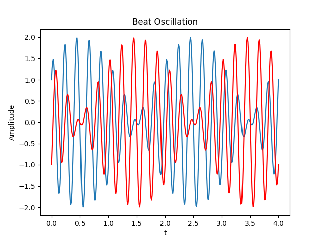
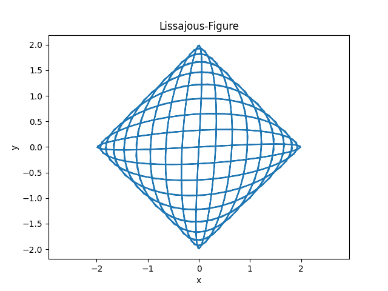

[plt.figure]: <https://matplotlib.org/stable/api/_as_gen/matplotlib.pyplot.figure.html> "plt.figure"
[plt.show]: <https://matplotlib.org/stable/api/_as_gen/matplotlib.pyplot.show.html> "plt.show"

# Setzen von Default-Werten – Schwebung

## Einleitung

Die Übung beschäftigt sich mit dem Setzen von Default-Werten in Funktionen, also
Werten, die bei fehlenden Input-Parametern automatisch gesetzt werden.
Hierfür ist eine Python-Funktion `beat` und
ein Python-Skript `plot_beat`, das die Ergebnisse der Funktion
`beat` visualisert, zu erzeugen.

### Setzen von Default-Werten

In Funktionen werden oft Parameter benötigt, die (fast immer) konstante Werte annehmen, z.B. der Brechungsindex von Luft oder die Fallbeschleunigung. Diesen kann man in der Definition einer Funktion einem Default-Wert zuordnen:

```python
def free_fall(t, x_0, v_0, g=9.81)
```

Beim Aufruf der Funktion können Default-Werte auch ausgelassen werden:

```python
t = 2.0
x_0 = 20.0
v_0 = 0.0
g_0 = 9.80665
x, v = free_fall(t, x_0, v_0)       # g = 9.81
x, v = free_fall(t, x_0, v_0, g_0)  # g = 9.80665
```

Bei der Funktionsdefinition sollten die Funktionsargumente mit Default-Werten immer hinter den Argumenten ohne Default-Werte gesetzt werden. Bei Argumenten ohne Default-Werte (*required arguments*) ist die Reihenfolge sehr wichtig, da sie bestimmt, welche Werte welchen Variablen zugeordnet werden.

In den folgenden Aufgaben sollen Sie lernen, mit Default-Werten in Funktionen umzugehen.

## Aufgabe

### Funktion

1. Schreiben Sie eine Python-Funktion `beat`, die mit dem Aufruf

    ```python
    x, y = beat(t, nu1, nu2, A)
    ```

    folgende Funktionen berechnet:
    $$
    \begin{aligned}
      x(t) &= A \left( \sin(2 \pi \nu_1 t) + \cos(2 \pi \nu_2 t) \right) \\
      y(t) &= A \left( \sin(2 \pi \nu_1 t) - \cos(2 \pi \nu_2 t) \right)
    \end{aligned}
    $$

    `t` ist ein Zeitvektor.

2. Setzen Sie für die Inputs `nu1`, `nu2` und `A` die Default-Werte auf

    $$
    \begin{aligned}
      \nu_1 &= 5.0 \\
      \nu_2 &= 4.5 \\
      A     &= 1.0
    \end{aligned}
    $$

### Skript

Schreiben Sie ein Python-Skript `plot_beat`, das die Ergebnisse der
Funktion `beat` graphisch darstellt.

1. Erzeugen Sie mit der Funktion `np.linspace` einen Vektor `t`, der 400
    Stützstellen im Bereich von 0 bis 4 enthält.

2. Rufen Sie `beat` so auf, dass abgesehen von `t` die Default-Werte verwendet werden.

3. Erstellen Sie eine Figure, in der die Schwebung geplottet wird:
    * Stellen Sie `x` und `y` als Funktion von `t` in einem
      Achsensystem dar.
      Die erste Linie soll $x(t)$ und die zweite Linie $y(t)$ darstellen.
      Der $y(t)$-Graph ist außerdem in roter Farbe zu zeichnen.

    * Geben Sie der Figure den Titel *Beat Oscillation*, beschriften Sie die x-Achse
      mit *t*, die y-Achse mit *Amplitude*

4. Erstellen Sie eine weitere Figure, die eine Lissajous-Figur darstellt:
    * Stellen Sie $y(x)$ dar. Das Ergebnis ergibt eine Lissajous-Figur
      (vorausgesetzt, `nu1` und `nu2` bilden ein rationales Verhältnis)

    * Geben Sie der Figure den Titel *Lissajous-Figure*, beschriften Sie die x-Achse
      mit *x*, die y-Achse mit *y*.

## Hinweise

* Es sind zwei Plots in getrennten Fenstern zu erstellen. Die erste
    Graphik soll eine Schwebung, und die zweite eine Lissajous-Figur darstellen.
    Um ein neues Fenster für einen Plot zu initialisieren, existieren die Funktionen [plt.figure] und [plt.show]. Für jede der Graphiken sind diese wie folgt zu verwenden:

```python
plt.figure()
# Plotbefehle
plt.show()
```

* Am Ende sollten Ihre Graphiken so aussehen:

<div align="center">

</div>

<div align="center">

</div>
