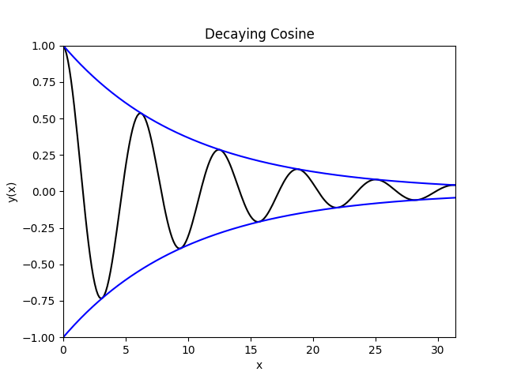

# Abklingende Cosinus-Funktion

## Einleitung

In diesem Beispiel sollen Sie Ihr Wissen aus dieser Woche ohne viele Hinweise anwenden. Schreiben Sie folgende Funktion `fun_exp` mit spezifizierten In- und Output:

```python
cos_exp, envelope = fun_exp(x, d)
```

| InOut | Name | Description |
|:-|:-|:-|
| Input | `x`  | x-Werte der Funktionen; Vektor |
| Input | `d`  | Abklingfaktor; Skalar |
| Output | `cos_exp` | Cosinus-Funktion in Exponentialdarstellung; Vektor |
| Output | `envelope` | einhüllende Funktion; Vektor |

welche folgende Funktionen berechnet:

$$
\begin{aligned}
  \text{cos\_exp}(x) &= \frac{1}{2}(\mathrm{e}^{ix} + \mathrm{e}^{-ix}) \\
  \mathrm{envelope}(x) &= \mathrm{e}^{-dx}
\end{aligned}
$$

## Darstellen der Funktionen

Folgender Variablen sind von Ihnen im Skript `cos_exp.py` zu erzeugen:

|Variable|Wert|
|:-|:-|
|`x`| Vektor von $0$ bis $10\pi$ mit $250$ Werten |
|`d`| Skalar $0.1$ |
|`y`, `A` | Aufruf der eigenen Funktion mit $y = \text{cos\_exp}(x)$, $A = \text{envelope}(x)$ |

Erzeugen Sie damit eine Figure mit mehreren Linien:

1. Plotten Sie $y(x) \cdot A(x)$; durchgehende Linie; schwarz
2. Plotten Sie $A(x)$; durchgehende Linie; blau
3. Plotten Sie $-A(x)$; durchgehende Linie; blau
4. Limits für Abszisse auf Minimum und Maximum von $x$
5. Limits für Ordinate auf Minimum von $-A(x)$ und Maximum von $A(x)$
6. Bezeichnen Sie die Abszisse mit $x$
7. Bezeichnen Sie die Ordinate mit $y(x)$
8. Schreiben Sie einen Titel mit der Bezeichnung `Decaying Cosine`


## Hinweise

* Erinnern Sie sich, mit welchem Symbol die imaginäre Einheit in Python dargestellt wird.

* Sie sollten eine Warnung erhalten, dass der Imaginärteil ignoriert wird. Überlgen Sie sich, wie Sie diese Warnung vermeiden können.

* Das Ergebnis sollte so ausschauen:

<center>

</center>