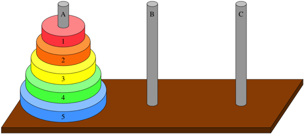

# Towers of Hanoi

## Introduction


<div align="center">

</div>

The Towers of Hanoi is a game where all disks must be moved from the starting rod (A in the image) to the target rod (B or C). Only one disk may be moved at a time, and no larger disk may be placed on a smaller disk.

## Task


Program the function
```python
solve_hanoi(n, start, destination, auxiliary)
```
that solves the Towers of Hanoi.

Here `n` is the number of disks, `start` is the starting position (A, B, or C), `destination` is the target, and `auxiliary` is the remaining rod.

The function should give you the instructions for the solution using print commands. For `solve_hanoi(3, 'A', 'B', 'C')` you should get the following:

Move disk 1 from A to B.\
Move disk 2 from A to C.\
Move disk 1 from B to C.\
Move disk 3 from A to B.\
Move disk 1 from C to A.\
Move disk 2 from C to B.\
Move disk 1 from A to B.

## Hint

* Write a function that calls itself until a termination condition is met.
