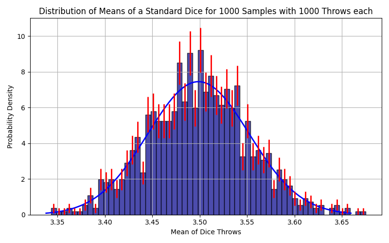

# Histogram with Error Estimation

## Introduction

In this task, we deal with the visualization and statistical analysis of sample means of a fair die. The goal is to develop a better understanding of the Gaussian distribution and the associated uncertainties. To do this, we will implement several Python functions that enable the calculation of the Gaussian distribution, the generation of sample means, and the uncertainty estimation for the resulting histograms.

### Gaussian Distribution

The Gaussian distribution is given by:

  $$
  f(x) = \frac{1}{\sigma \sqrt{2\pi}} \exp{\left({-\frac{1}{2} \left(\frac{x - \mu}{\sigma}\right)^2}\right)}
  $$

With the mean $\mu$ and the standard deviation $\sigma$.


## Tasks

1. **Helper file**
    - Create a Python file named `helpers.py`. Add all functions you use to this file.
    - Then import the functions into the Python script `histogram.py`.
    ```python
    from helpers import func1, func2, func3
    ```

2. **Gaussian Distribution**
    - Implement the function `calc_gauss`, which calculates the Gaussian distribution with the parameters `mu` (mean) and `sigma` (standard deviation).
3. **Generation of Sample Means**
    - Implement the function `get_dice_mean`. This should output the sample means of a fair die as a list (`N` samples of `N_throws` throws each).
    ```python
    def get_dice_mean(N, N_throws = 10000):
        """
    calculate the mean of N_throws of dice throws for N samples

    Parameters:
    N : int
        Number of samples generated.

    N_throws : int
        Number of dice throws per sample. Default is 10000.

    Returns:
        List of means of N_throws of dice throws for N samples.
    """
    ```

5. **Uncertainty Estimation**
    - Implement the function `calc_frequentist_uncertainty`, which outputs the height of the bins, their uncertainty, and their center.
    ```python
    def calc_frequentist_uncertainty(sample_means, N_bins):
    """
    Calculate the frequentist uncertainty of the sample means.

    Parameters:
        sample_means : List of sample means.
        N_bins : Number of bins for the histogram.

    Returns:
        h_i: array with heights of the bins
        sig_h_i: array with uncertainties of the heights of the bins
        bin_centers: array with centers of the bins
    """
    ```
    - Use `np.histogram` and the formulas for a normalized histogram
    $$
      h_i = \frac{N_i}{N b_i}
    $$

    $$
      \sigma_{h_i} = \frac{1}{b_i N} \sqrt{N_i (1 - \frac{N_i}{N})},
    $$
    where $N_i$ is the number of values in bin $i$ and $b_i$ is the width of bin $i$ (for us all bins have the same width).
1. **Visualization**
    - Now visualize the results in `histogram` in the form of a (surprise) histogram. Set the parameter `density` in the function `matplotlib.pyplot.hist` to `True` to get the probability density.
    - Create the Gaussian distribution corresponding to your sample means.
    - Create error bars using `calc_frequentist_uncertainty`.
    - Label the graph.

2. **Considerations**
    - Change the parameters `N`, `N_throws`, and `bins`. What conclusions do you draw from this?
    - What weakness does our error estimation have?

## Hints

* Reference plot:

<div align="center">

</div>
