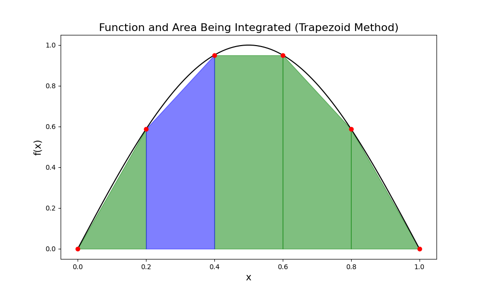
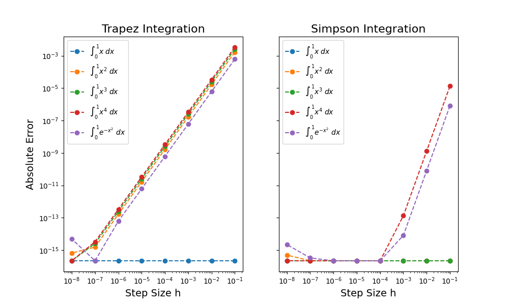

[ValueError]: https://docs.python.org/3/library/exceptions.html#ValueError
[erf]: https://docs.scipy.org/doc/scipy/reference/generated/scipy.special.erf.html
[epsilon]: https://numpy.org/doc/stable/reference/generated/numpy.finfo.html
[np.sum]: https://numpy.org/doc/stable/reference/generated/numpy.sum.html
# Numerische Integration

## Einleitung

Um numerisch zu integrieren teilen wir unser Integral in mehrere kleinere Integrale auf. Unsere erste Integrationsmethode ist die simpple Trapezmethode. Dabei konzentrieren uns zuerst nur auf das Teilintegral in blau, siehe Skizze. Dieses können wir allgemein als $\int_{x_i}^{x_{i + 1}} f(x) \, dx$ schreiben und approximieren es als

$$
\int_{x_i}^{x_{i + 1}} f(x) \, dx \approx f_{i + 1} \cdot h + \frac{(f_{i} - f_{i + 1})}{2} \cdot h \\ = \frac{h(f_{i} + f_{i + 1})}{2},
$$


wobei wir die Notation $f_{i} = f(x_{i})$ und $h = x_{i + 1} - x_i$ benutzt haben.

<div align="center">

</div>


Nun betrachten wir das vollständige Integral, sprich vom Start $a$ bis zum Ende $b$. Wir diskretisieren für  equidistante Werte mittels $x_i = a + i \cdot h$ mit $h = \frac{b - a}{N}$. Der Wert des vollständigen Integrals wird daher mittels Trapezmethode zu $I_\mathrm{t}$, was wir umschreiben können zu

$$
\int_{a}^{b} f(x) \, dx \approx I_\mathrm{t} = \frac{h(f_{0} + f_{1})}{2} + \frac{h(f_{1} + f_{2})}{2} \dots + \frac{h(f_{N - 2} + f_{N - 1})}{2}+ \frac{h(f_{N - 1} + f_{N})}{2} \\ = \frac{h(f_{0} + f_{N})}{2} + h \sum ^{N - 1} _{i=1} f_i.
$$

Von unserer Skizze aus wird uns klar, dass unser Ergebnis näher am korrekten Wert sein wird, wenn wir $N$ erhöhen und damit $h$ verkleinern. Um  herauszufinden wie der Fehler der Integrationsmethode mit $h$ skaliert, könnte man eine Taylorreihenentwicklung machen, wir wollen jedoch graphisch vorgehen.


## Aufgabe


  1. Schreiben Sie in `numeric_int.py` eine Funktion, die die Trapezmethode nach oben angegebener Formel nutzt. Gehen Sie dabei ohne Schleifen vor.
```python
  def trapezoidal(fun, a, b, N):
    """
    input:
    fun: Funktion die integriert werden soll
    a: untere Grenze der Integration
    b: obere Grenze der Integration
    N: Anzahl der Teilintervalle
    
    output:
    I_t: Wert des Integrals
    """

```

2. Schreiben Sie in `numeric_int.py` analog dazu eine Funktionn, die die Simpsonmethode nutzt. Diese nutzt für jedes Teilintegral $3$ Punkte und das Gesamtintegral wird approximiert als

$$
\int_{a}^{b} f(x) \, dx \approx I_\mathrm{s} = \frac{h}{3} (f_0 + 4 f_1 + 2 f_2 + 4 f_3 + \dots + 2 f_{N-2} + 4 f_{N - 1} + f_N).
$$

Gehen Sie auch hier ohne Schleife vor. Nutzen Sie [ValueError] falls $N$ ungerade ist, da die Gleichung in dieser Form nur für gerade Werte von $N$ gilt.

```python
  def simpson(fun, a, b, N):
    """
    input:
    fun: Funktion die integriert werden soll
    a: untere Grenze der Integration
    b: obere Grenze der Integration
    N: Anzahl der Teilintervalle
    
    output:
    I_s: Wert des Integrals
    """
```


3. Nutzen Sie  in `integrate.py` nun Ihre Funktionen um analytisch-lösbare Integrale zu berechnen. Nutzen Sie lambda Funktionen für $\int_0^1 x~dx, \int_0^1 x^2~dx, \int_0^1 x^3~dx, \int_0^1 x^4~dx$ und $\int_0^1 e^{-x^2}~dx$. Damit können wir den absolute Fehler der Methoden als Funktion vom Abstand der Intervalle, $h$, analysieren. Erstellen Sie dazu das $3$-dimensionale Arrays `errors` mit den Dimensionen `(i, j, 2)`, wobei in `[i, j, 0]` die Fehler für die Trapezmethode und `[i, j, 1]` die Fehler für die Simpsonmethode gespeichert werden sollen. Hierbei ist $i$ der Index für die verschiedenen Funktionen ist und $j$ der Index für die verschiedenen $N$ (und damit $h$ da wenn wir die Anzahl an Intervalle erhöhen, wir damit die Intervallbreite verkleinern). Dabei soll $N$ die Werte `[10, 100, 1000, 10000, 100000, 1000000, 10000000, 100000000]` annehmen. Probieren Sie Ihre Funktion jedoch zuvor mit niedrigeren Werten von $N$ aus (Hier werden Sie lange warten müssen, falls Sie Schleifen genutzt haben).

4. Setzten Sie Fehler, die kleiner sind als die Maschinengenauigkeit (epsilon) auf [epsilon].

5. Erstellen Sie einen dopppelt-logarithmischen Subplot für die Fehler, siehe Abbildung. Speichern Sie ihre Abbildung als `integration_errors.png`.


## Hinweise
* $\int_0^1 e^{-x^2}~dx = \frac{\sqrt{\pi}}{2} \cdot \text{erf(1)}$, wobei [erf] die Fehlerfunktion ist.

* Nutzen Sie für die Integrationsmethoden [np.sum] anstelle von sum. Sehen Sie einen Unterschied?

* Food for thought: Warum skalieren die Fehler der verschiedenen Funktionen unterschieldich? Überlegen Sie sich warum der Fehler für sehr kleine Abstände von $h$ ansteigt. Was schließen Sie daraus?

* Ihre Abbildung sollte in etwa so aussehen:


<div align="center">

</div>
