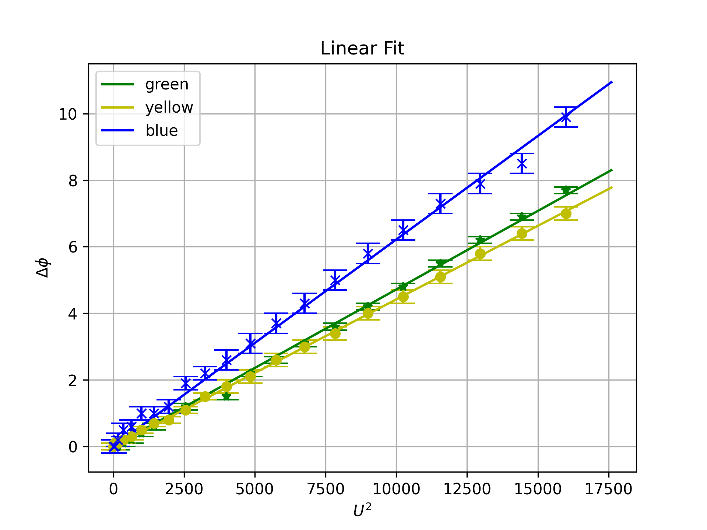

[Wahrscheinlichkeitstheorie]: <http://itp.tugraz.at/LV/wvl/Statistik/A_WS_pdf.pdf>
[doppelbrechend]: <http://de.wikipedia.org/wiki/Doppelbrechung>
[np.loadtxt]: <https://numpy.org/doc/stable/reference/generated/numpy.loadtxt.html> "np.loadtxt"
[plt.errorbar]: <https://matplotlib.org/stable/api/_as_gen/matplotlib.pyplot.errorbar.html> "plt.errorbar"
[np.polyfit]: <https://numpy.org/doc/stable/reference/generated/numpy.polyfit.html> "np.polyfit"

# Kerrzelle

## Einleitung

Bringt man isotrope Dielektrika in ein homogenes elektrisches Feld,
so erhalten diese die optischen Eigenschaften eines einachsigen
Kristalls und werden [doppelbrechend]. Für den
Phasenunterschied $\Delta\phi$ von ordentlichem und außerordentlichem
Strahl folgt nach dem *empirischen Gesetz von Kerr*:
$$
  \Delta \phi = c\cdot U^2 \quad
  \begin{array}{rcl}
    c & \ldots & \text{Konstante, die aber von der Wellenlänge des Lichtes abhängt} \\
    U & \ldots & \text{Spannung an einem Kondensator, der das elektrische Feld erzeugt}
  \end{array}
$$

In einem Laborversuch wurden hierzu Daten in `kerrtab_pu.dat` aufgezeichnet.
Die Datei `kerrtab_pu.dat` enthält folgende Daten:

* Spalte 1: $U^2$
* Spalte 2: $\Delta\phi$ für grünes Licht
* Spalte 3: Fehler für grünes Licht
* Spalte 4: $\Delta\phi$ für gelbes Licht
* Spalte 5: Fehler für gelbes Licht
* Spalte 6: $\Delta\phi$ für blaues Licht
* Spalte 7: Fehler für blaues Licht

## Aufgabe

Schreiben Sie ein Python-Skript `kerr_cell`, in dem Sie die Daten des Laborversuchs auswerten:

1. Laden Sie die Daten aus `kerrtab_pu.dat` mit Hilfe von [np.loadtxt].

2. Erzeugen Sie eine Grafik und plotten Sie mit [plt.errorbar] für die einzelnen Farben jeweils die $\Delta\phi$ inklusive deren Fehler in Abhängigkeit von $U^2$ (alle drei ins selbe Achsensystem). Hilfe zum Plotten mit Errorbars erhalten Sie in den Hinweisen.

    * Verwenden Sie als Linienfarbe entsprechend grün, gelb und blau.
    * Für die Marker verwenden Sie `*`, `o` und `x`.
    * Verbinden Sie die Datenpunkte **nicht**.
    * Halten Sie sich an diese Plotreihenfolge.
    * Geben Sie den Fehlerbalken-Kappen die Größe 8.

3. Führen Sie für die Konstanten `c_green`, `c_yellow` und
  `c_blue` einen linearen Fit durch. Für das lineare Fitten erhalten Sie Hilfe in den Hinweisen.

4. Geben Sie alle Konstanten formatiert in der obigen
   Reihenfolge auf folgende Art aus:

    `U^2 dependence of phi for green light: 0.00047174`
  
    Achten Sie dabei auf die genaue Schreibweise!

5. Plotten Sie die 3 Ausgleichsgeraden `y_green = c_green*x` etc., über einem Vektor
    `[0, 1.1*max(U^2)]` mit 100 Stützstellen.

6. Schalten Sie das Gitternetz (`grid`) für die Grafik ein.

7. Beschriften Sie die Achsen mit $U^2$ und $\Delta\phi$
   (in LaTeX-Syntax, siehe Hinweis).

8. Betiteln Sie die Grafik mit `Linear Fit`.

9. Erstellen Sie eine Legende mit `green`, `yellow` und
  `blue`. (Das ist auch sinnvoll, wenn das Bild schwarz-weiß
  ausgedruckt wird).

10. Positionieren Sie die Legende links oben.

11. Speichern Sie die Grafik unter dem Dateinamen `voltage_dependence.png`.

## Hinweise

* Zum Einlesen der Daten können Sie [np.loadtxt] verwenden. `dtype=np.float64` kann hilfreich sein.

* Erstellen Sie zuerst alle Errorbars und anschließend die drei Ausgleichsgeraden.

* Man kann den Befehl [np.polyfit] zum linearen Fitten verwenden. Dabei wird jedoch die Ausgleichsgerade nicht unbedingt
 durch den Ursprung gelegt. Wenn man das erreichen will, darf man für
 die Gerade nur die Formel $y = kx$ verwenden. Damit bleibt dann als
 einziger zu fittender Parameter die Steigung $k$. Diese ergibt sich aus ($N$ = Anzahl der Datenpunkte)
 $$k = \frac{\sum_{n=1}^{N}x_n y_n}{\sum_{n=1}^{N}x_n^2}$$

* Für Interessierte: Die analytischen Berechnungen zur linearen Regression finden Sie
 im Skriptum [Wahrscheinlichkeitstheorie] ab Seite 296.

* In Matplotlib-Grafiken können Sie in Beschriftungen und Titel LaTeX-Syntax auf die folgende Weise einfügen:

    ```python
    plt.title(r"$\Delta U$")
    ```

* Die Textausgabe sollte so aussehen:

    ```
    U^2 dependence of phi for green light: 0.00047174
    U^2 dependence of phi for yellow light: 0.00044188
    U^2 dependence of phi for blue light: 0.00062186
    ```

    Um die korrete Anzahl der Stellen der Zahl zu bekommen, verwenden Sie .nf wobei n die Anzahl der gewünschten Stellen angibt. Zum Beispiel:

    ```
    print(f"U^2 dependence of phi for green light: {c_green:.8f}")
    ```

    Achtung! Für den Test müssen die Werte auf genau 8 Stellen gerundet werden.


* Wenn Sie alles richtig gemacht haben, sollte Ihre Grafik so aussehen:

<div align="center">

</div>


