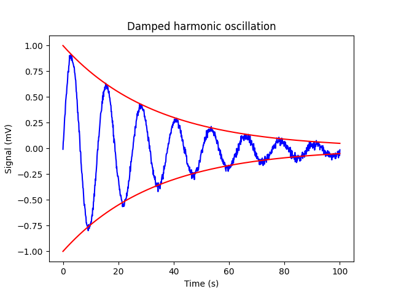

[np.loadtxt]: <https://numpy.org/doc/stable/reference/generated/numpy.loadtxt.html> "np.loadtxt"
[np.mean]: <https://numpy.org/doc/stable/reference/generated/numpy.mean.html> "np.mean"
[matplotlib.pyplot]: <https://matplotlib.org/3.5.3/api/_as_gen/matplotlib.pyplot.html> "matplotlib.pyplot"
[np.exp]: <https://numpy.org/doc/stable/reference/generated/numpy.exp.html> "np.exp"

# Lab Exercise 2

## Introduction

In the following task, you should read measurement data from an oscilloscope measurement and display it graphically. Tasks like this will frequently appear in laboratory exercises later.

## Task

1. Read the data from an oscilloscope measurement from the file `oscillation.dat` using [np.loadtxt]. Set the data type to `np.float64`. The data is to be interpreted as follows:

   | Left Column      | Right Column     |
   |------------------|------------------|
   | Time in seconds  | Measurement signal in mV |

2. Look at the data by plotting it using [matplotlib.pyplot]. Use a solid blue line for the data.

3. There seems to be an offset in the data (zero displacement of the oscillation not on the x-axis). Calibrate the signal so that the zero displacement is on the x-axis (i.e., at y = 0) when plotting.

4. This is apparently a damped harmonic oscillation whose amplitude of 1 decays exponentially. Use [np.exp] to plot the two envelope exponential functions of the amplitude. Use a solid red line and set the damping constant to $\delta = 0.03$.

5. Label the x-axis with `Time (s)` and the y-axis with `Signal (mV)`. Give your graph the title `Damped harmonic oscillation`.

## Hints

* When loading the data, don't forget to pay attention to the data type (`np.float64`) and the comments (`comments='%'`)!

* To subtract the offset from the data, use [np.mean].

* More information on plotting data can be found in the [matplotlib.pyplot] documentation.

* Attention! Pay attention to the order of the plots. Make sure to plot the envelope second! The upper envelope curve of the exponential decay must be plotted first, otherwise the test will recognize this as an error.

* At the end, your plot should look like this:

