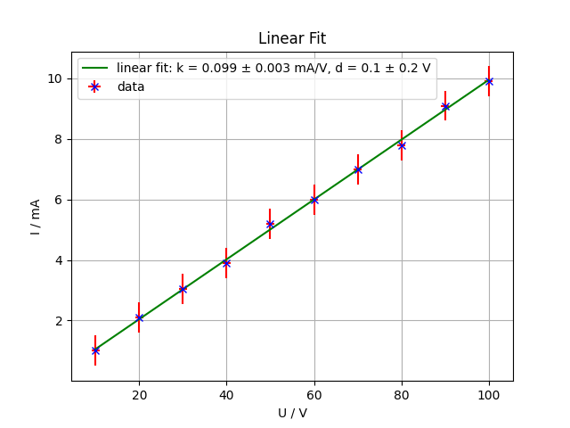

[np.polyfit]: <https://numpy.org/doc/stable/reference/generated/numpy.polyfit.html>
[plt.errorbar]: <https://matplotlib.org/stable/api/_as_gen/matplotlib.pyplot.errorbar.html>
[Wahrscheinlichkeitstheorie]: <http://itp.tugraz.at/LV/wvl/Statistik/A_WS_pdf.pdf>

# Laborübung 3

## Einleitung

Diese Übung soll eine Einführung in das Fitten und Plotten von mit Unsicherheit behafteten Daten sein.
Als Daten stehen in dieser Übung Strom und Spannungsmessungen zur Verfügung, welche im File `data_lab3.dat` abgespeichert
sind. Die erste Spalte enthält die Spannungswerte, die zweite die Stromwerte.

Einfache Fits von Polynomfunktionen können in Python mithilfe der `numpy`-Funktion [np.polyfit] durchgeführt werden.
Die Funktion verwendet ein sogenanntes *linear least squares*-Verfahren, bei dem die Parameter der Polynomfunktion so
berechnet werden, dass sie die Daten am besten beschreiben. Die Funktion ist für ein Polynom von Grad `n` dabei so anzuwenden:

```python
popt, pcov = np.polyfit(xdata, ydata, deg=n, pcov=True)
```

`popt` sind hierbei die optimierten Parameter und `pcov` ist die sogenannte Kovarianzmatrix. Die Wurzeln der Diagonalelemente der Matrix sind dabei die Standardabweichung der ermittelten Parameter
(für Details siehe Skript [Wahrscheinlichkeitstheorie]). Die gefitteten Funktionen lassen sich dann mit den Unsicherheiten als Fehlerbalken mithilfe von [plt.errorbar] plotten (siehe Dokumentation).

## Aufgabe

Schreiben Sie ein Skript `lab_exercise3.py`, in dem Sie die Daten des Laborversuchs auswerten:

1. Laden Sie die Daten aus `data_lab3.dat` und speichern Sie die Spalten in dafür geeigneten Vektoren. Achten sie darauf, dass im ganzen Programm nur mit **Milliampere** und nicht mit Ampere gerechnet wird.

2. Erstellen Sie zwei Vektoren der richtigen Länge, die mit der Unsicherheit der Messungen gefüllt sind. Die Unsicherheit der Strommessung beträgt 0.5 mA, die der Spannungsmessung 1 V.

3. Fitten Sie die Daten mit einer Gerade (Polynom erster Ordnung). Verwenden Sie dazu den Befehl [np.polyfit].

4. Speichern Sie die Fit-Parameter in den Variablen `slope` und `offset`.

5. Speichern Sie die Unsicherheit der Fit-Parameter in den Variablen `delta_slope` und `delta_offset` für ein 95%-Konfidenzintervall (2 Sigma).

6. Erstellen Sie einen Vektor `U_fit` mit 100 Werten zwischen dem kleinsten und größten Spannungswert.

7. Erstellen Sie einen Vektor `I_fit`, in welchem mittels `U_fit`, der Steigung `slope` und der Nullpunktsverschiebung `offset` die Stromwerte der Geraden berechnet werden.

8. Erzeugen Sie eine Grafik und plotten Sie mit [plt.errorbar] die Stromwerte in mA auf der y-Achse gegen die Spannungswerte in V auf der x-Achse mit ihren jeweiligen Unsicherheiten aus Punkt 2.
    * Verwenden Sie als Linienfarbe für die Fehlerbalken rot.
    * Für die Marker verwenden Sie blaue `x`.
    * Verbinden Sie die Datenpunkte **nicht**.

9. Plotten Sie die Gerade (`I_fit` gegen `U_fit`) als durchgezogene Linie in grün.

10. Geben Sie der Grafik den Titel *Linear Fit* und beschriften Sie die Achsen wie in **Laboruebung 1** gelernt.

11. Erstellen sie eine Legende für die Plots.
    Geben Sie dafür für jeder Linie ein `label`-Attribut mit dem jeweiligen Text hinzu. Anschließend zeigen Sie die Legende an mit

    ```python
    plt.legend()
    ```

    Der Text für das Label für den Fit soll in einer von Ihnen zu erstellenden Variable definiert werden:

    ```
    linear fit: k = `slope` ± `delta_slope` mA/V, d = `offset` ± `delta_offset` V
    ```

    Die Variablen sind dabei wie im vorangegangen Beispiel mit f-Strings einzusetzen. Die Anzahl an Nachkommastellen soll dabei so gewählt werden, dass die Unsicherheit genau einen Zahlenwert ungleich 0 besitzt. Auf diese Anzahl an Nachkommastellen ist auch der zugehörige Parameter zu setzen. Die Ermittlung der Anzahl an Stellen kann händisch erfolgen, es benötigt dazu kein Programm!

## Hinweise

* Achten Sie auf die kommentierte erste Zeile des Datenfiles!

* Um das 95%-Konfidenzintervall mit 2 Sigma zu erhalten multiplizieren Sie die Unsicherheit der Fit-Parameter mit 2

* Beim Plotten mit [plt.errorbar] können Sie mit den *keyword arguments* `fmt`, `color` und `ecolor` den Marker sowie die Farben der Datenpunkte und der Fehlerbalken einstellen. Mit `capsize` modifizieren Sie die Größe der Fehlerbalken.

* Um das Zeichen ± zu erhalten, kopieren Sie es einfach aus der Angabe oder nutzen Sie den LaTeX-Mathemodus mit `$\pm$`.

* Wenn Sie alles richtig gemacht haben, sollte Ihre Grafik so aussehen:

<div align="center">

</div>
