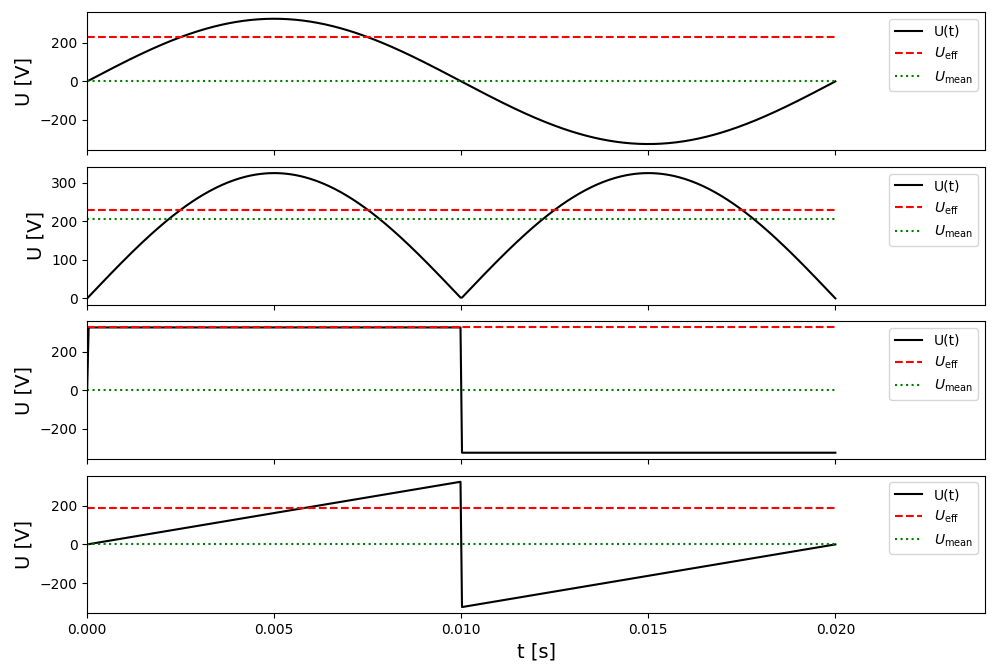

[np.mod]: <https://numpy.org/doc/stable/reference/generated/numpy.mod.html> "np.mod"
[np.sign]: <https://numpy.org/doc/stable/reference/generated/numpy.sign.html> "np.sign"

# Lambda Functions

## Introduction

Python lambda functions are an elegant way to create anonymous functions. Unlike named functions (def ...), lambda functions in Python can be defined without a separate definition. They are often used in situations where a short-lived function is needed, such as when sorting lists or defining functions that are passed as arguments to other functions. You write them as

```python
make_double = lambda x: 2*x
a = make_double(5)
```


## Tasks
Complete the following tasks:

1. Write a lambda function `adder` that calculates the sum of two numbers.

2. Initialize `data = [(2, 3), (12, 3), (-4, 5), (6, -7), (8, 9), (-3, 11)]`, a list with $x$ and $y$ values as tuples. Use lambda functions as key input for the `sorted` command to sort the list once by the $y$ value and once by the distance to the origin. Save the sorted lists as `sorted_y` and `sorted_r` respectively.

3. Initialize `l = [7, 2, 3, 12, 6, 13, 4]` and use `list` and `filter` together with a lambda function to generate the list `evens` that contains only even numbers. The command `list(filter(lambda x: x >= 7, l))` for example generates a list with all values greater than or equal to $7$.


4. Create the named function `calc_multiple(n)` that returns a lambda function. This lambda function multiplies its own argument by the value `n` that is passed when calling calc_multiple. In this example, $12$ should be output:

    ```python
    doubler = calc_multiple(2)
    print(doubler(6))
    ```


Now we use lambda functions to examine the [arithmetic mean](http://en.wikipedia.org/wiki/Arithmetic_mean)

$$\bar{U}(t) = \frac{1}{T}\int_0^T U(t) dt$$

and the [RMS value](http://en.wikipedia.org/wiki/Root_mean_square)

$$U_{\mathrm{eff}}(t) = \sqrt{\frac{1}{T}\int_0^T U(t)^2 dt}$$

of a periodic signal


1. Save in the variable `U_0` the amplitude voltage $U_0 = 230\sqrt{2}$ and in `f` the frequency $f=50$.

2. Calculate the period duration from the frequency in the variable `T`.

3. Create a vector `t` with `500` equidistant values from `0` to `T`.

4. From `U_0`, `f`, and `T`, four different signal forms are now generated. Create the following lambda functions for this:
    * `f_sin(t)` Sinusoidal signal with amplitude `U_0` and frequency `f`

    * `f_abssin(t)` Like `f_sin(t)`, but the signal should always be positive

    * `f_square(t)` Square wave signal with amplitude `U_0` and frequency `f` (see hint).

    * `f_saw(t)` Sawtooth signal from $-U_0$ to $+U_0$ with slope $k=4fU_0$ (see hint).

    Don't forget that you can test your functions using graphs.

5. Now use a loop to iterate over all functions and fill the arrays `U_mean` and `U_eff` respectively. Use [integrate.simpson](https://docs.scipy.org/doc/scipy/reference/generated/scipy.integrate.simpson.html) from scipy for the integrals.


6. In the same loop, display the four signals in subplots one below the other with a shared $x$-axis. Draw the mean and the RMS value as horizontal lines.


7. Label the axes and create legends.

## Hints
* For the square wave signal, use the command [np.sign].

* For the sawtooth signal, use the command [np.mod].

* The result should look like this:

<div align="center">

</div>
