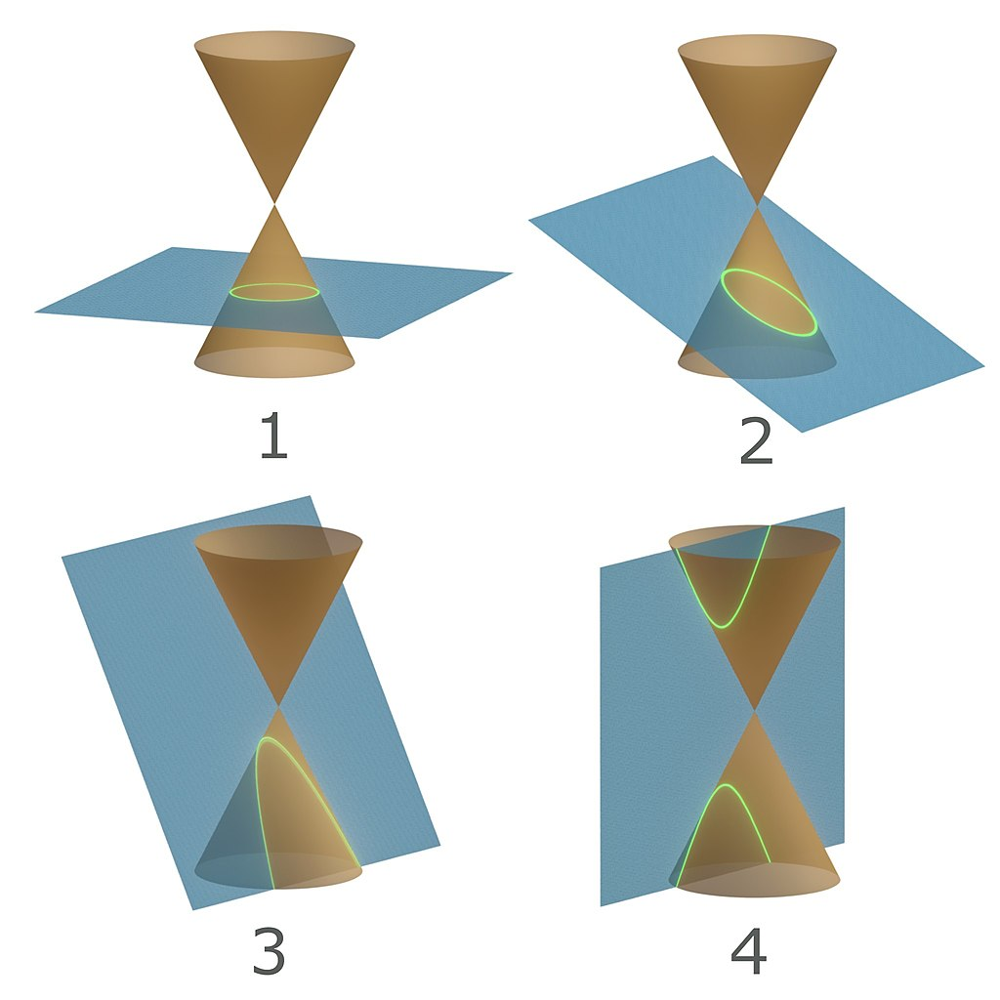
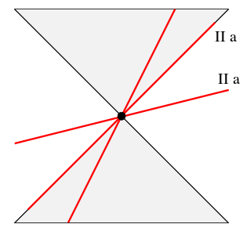
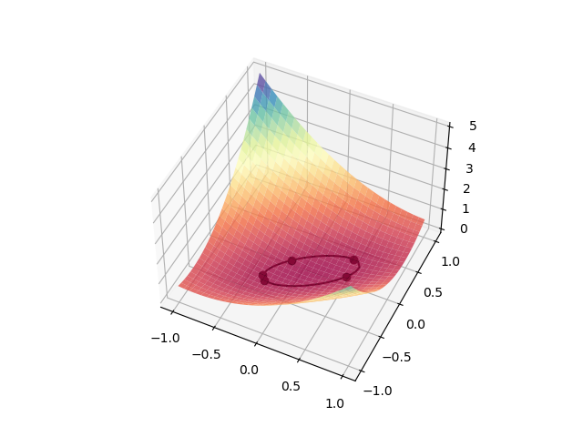
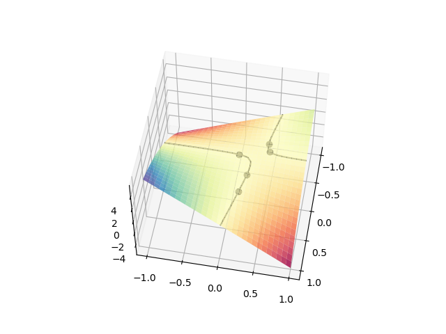
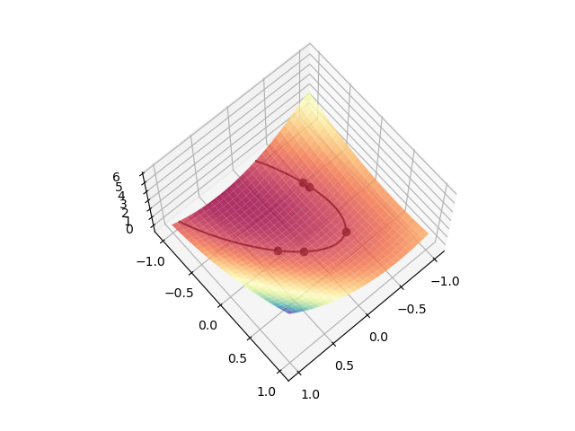

# Linear System of Equations, Conic Sections

## Introduction

A [conic section] is a curve that results when the surface of a
double cone is intersected with a plane. This produces either an ellipse (2), where
a circle is a special form of it (1), a parabola (3), or a hyperbola (4).

<div align="center">

</div>

If the cutting plane passes through the apex of the cone, a point, a line, or
a pair of lines can result.

<div align="center">

</div>

In general, conic sections can be written in the following form (generalized
quadratic form)

$$
   z(x,y) = s_1 x^2 + 2 s_2 x y + s_3 y^2 + s_4 x + s_5 y + s_6 \; .
$$

For known data points $x_d$ and $y_d$, one can interpret $z(x_d,y_d)=0$ as a linear
system of equations for $s_i$ $\mathbf{As}=\mathbf{b}$, that is

$$
   s_1 x_d^2 + 2 s_2 x_d y_d + s_3 y_d^2 + s_4 x_d + s_5 y_d + s_6 = 0 \; .
$$

Since we have six unknowns $s_i$, we also need six data pairs. Convince yourself
if necessary with pen and paper that this can equivalently be written in matrix notation:

$$
\begin{bmatrix}
x_1^2 & 2x_1y_1 & y_1^2 & x_1 & y_1 & 1 \\
x_2^2 & 2x_2y_2 & y_2^2 & x_2 & y_2 & 1 \\
x_3^2 & 2x_3y_3 & y_3^2 & x_3 & y_3 & 1 \\
x_4^2 & 2x_4y_4 & y_4^2 & x_4 & y_4 & 1 \\
x_5^2 & 2x_5y_5 & y_5^2 & x_5 & y_5 & 1 \\
x_6^2 & 2x_6y_6 & y_6^2 & x_6 & y_6 & 1 \\\end{bmatrix}  \,
\begin{bmatrix} s_1 \\ s_2 \\ s_3 \\ s_4 \\ s_5 \\ s_6 \end{bmatrix} \ =
\begin{bmatrix} 0 \\ 0 \\ 0 \\ 0 \\ 0 \\ 0 \end{bmatrix}. \;
$$

In this form, however, it is a homogeneous system of equations that always has the trivial
solution $s_i=0$. But we can help ourselves here by setting one of the coefficients
$s_k=1$ and moving the corresponding term to the right side. If we choose **for
example** the third term $s_3=1$, the inhomogeneous system of equations becomes

$$
  s_1 x_d^2 + 2 s_2 x_d y_d + s_4 x_d + s_5 y_d + s_6 = -y_d^2 \; ,
$$

or respectively

$$
\begin{bmatrix}
x_1^2 & 2x_1y_1 & x_1 & y_1 & 1 \\
x_2^2 & 2x_2y_2 & x_2 & y_2 & 1 \\
x_3^2 & 2x_3y_3 & x_3 & y_3 & 1 \\
x_4^2 & 2x_4y_4 & x_4 & y_4 & 1 \\
x_5^2 & 2x_5y_5 & x_5 & y_5 & 1 \\
\end{bmatrix}  \,
\begin{bmatrix} s_1 \\ s_2  \\ s_4 \\ s_5 \\ s_6 \end{bmatrix} \ =
\begin{bmatrix} -y_1^2 \\ -y_2^2 \\ -y_3^2 \\ -y_4^2 \\ -y_5^2 \end{bmatrix}. \;
$$

Because we now have only five unknowns, we now only need five
data pairs $(x, y)$ to fully define our linear system of equations $\mathbf{As}=\mathbf{b}$.

## Task

Now write a script `linalg_conic_sections` in which you solve the following tasks:

1. Create two vectors `xd` and `yd` with five uniformly distributed random numbers
   between $-0.5$ and $0.5$ using [np.random.rand].

1. Using these vectors, create the auxiliary matrix

$$
M = [x_d^2~,~2 x_d y_d~,~y_d^2~,~x_d~,~y_d~,~1],
$$

or in matrix notation

$$
\begin{bmatrix}
    x_1^2 & 2x_1y_1 & y_1^2 & x_1 & y_1 & 1 \\
    x_2^2 & 2x_2y_2 & y_2^2 & x_2 & y_2 & 1 \\
    x_3^2 & 2x_3y_3 & y_3^2 & x_3 & y_3 & 1 \\
    x_4^2 & 2x_4y_4 & y_4^2 & x_4 & y_4 & 1 \\
    x_5^2 & 2x_5y_5 & y_5^2 & x_5 & y_5 & 1 \\
\end{bmatrix}.
$$

3. Create the integer random number `n` in the interval [0, 5]. This number represents
   the index of the column that should be moved to the right side of the system of equations.

1. Use this to create the logical vector `L`, which is False at position `n` and
   True at all other positions.

1. Now create the matrix `A` and the inhomogeneity vector `b`. Use your
   logical vector `L` or its negation `~L` for this. See hints. Pay attention to
   the signs!

1. Solve the corresponding system of equations $\mathbf{As}=\mathbf{b}$. Make sure
   that `s` must be $1$ at position `n`. So solve only for `s[L]` and
   set the one at the remaining position. With this, the problem is solved and the
   result must still be visualized.

1. For this, create two vectors `x` and `y` with `30` points between `-1` and `1`.
   All combinations of `x` and `y` values (which are needed for a 3-dimensional plot)
   can be generated with the command [np.meshgrid], yielding the
   matrices `xx` and `yy`. By evaluating the first equation in the *Introduction*,
   you obtain `zz(xx,yy)` for these matrices.

1. Display the surface `zz` [graphically] in a 3D plot, where the color represents the
   value of the function (see hints for examples). Choose a
   [colormap].

1. Draw the data points as points in this plot. The points should
   not be connected by lines.

1. Draw the resulting conic section as a contour line. For this, there is the
   matplotlib command [contour]. However, we are looking for the intersection $z(x,y) = 0$. Therefore,
   set `levels` to the number $0$.

## Hints

- `A` consists of all rows of `M`, but not all columns. Column `n`
  is not contained in `A`. Use `L` or `~L` as column index for this. Analogously,
  the vector `b` consists only of the negative `n`-th column of `M`.

<div align="center">

</div>

<div align="center">

</div>

<div align="center">

</div>

- If you start the Python script not in Interactive Mode, but in the terminal
  ("Run Python-File in VSCode), a window opens for the plot where you can rotate the 3D
  plot with the cursor and change the perspective. (Don't forget plt.show()!)

- Before generating random numbers with numpy for the first time, set the seed to
  a fixed value. You can change the value to get different pseudo-random numbers
  and thus different conic sections. For the test to work, you must
  set the seed to $3$.

```python
np.random.seed(3)
```

[colormap]: https://matplotlib.org/stable/tutorials/colors/colormaps.html "colormap"
[contour]: https://matplotlib.org/stable/api/_as_gen/matplotlib.pyplot.contour.html "contour"
[graphically]: https://matplotlib.org/stable/gallery/mplot3d/surface3d.html "graphically"
[conic section]: https://en.wikipedia.org/wiki/Conic_section "conic section"
[np.meshgrid]: https://numpy.org/doc/stable/reference/generated/numpy.meshgrid.html "np.meshgrid"
[np.random.rand]: https://numpy.org/doc/stable/reference/random/generated/numpy.random.rand.html "np.random.rand"
