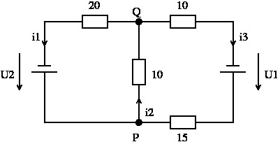

[linalg.solve]: <https://numpy.org/doc/stable/reference/generated/numpy.linalg.solve.html> "linalg.solve"

# Linear Systems of Equations and Kirchhoff's Rules

## Introduction

A linear system of equations of the form $\mathbf{Ax} = \mathbf{b}$ is homogeneous if $\mathbf{b} = \mathbf{0}$, otherwise it is inhomogeneous. Whether homogeneous or inhomogeneous, we can solve the linear system of equations using numpy.[linalg.solve].

For example, if we have the coefficient matrix $\mathbf{A}$ and the vector $\mathbf{b}$ given, we can calculate the solution vector $\mathbf{x}$.

$$
  \mathbf{A} =
  \begin{bmatrix}
    1 & 2 & -1 \\ 3 & 4 &  0 \\ -2 & 3 &  1
  \end{bmatrix}
  ,\quad
  \mathbf{b} =
  \begin{bmatrix}
    3 \\ 15 \\ 11
  \end{bmatrix}
$$


```python
import numpy as np

A = np.array([[1, 2, -1],[3, 4, 0], [-2, 3, 1]])
b = np.array([3, 15, 11])

x = np.linalg.solve(A, b)
```

$$
  \mathbf{x} =
  \begin{bmatrix}
    1 \\ 3 \\ 4
  \end{bmatrix}
$$


### Application


Given is a network with 4 ohmic resistors and 2 voltage sources:

<div align="center">

</div>

The resulting currents can be conveniently determined using Kirchhoff's rules:

**Junction rule:** *At every junction, the sum of the inflowing currents equals the sum of the outflowing currents.*
  In our example, this means:

* Junction P: $i_1-i_2+i_3=0$

* Junction Q: $-i_1+i_2-i_3=0$

 In this case, these are equivalent equations, meaning they give us the same information. Therefore, we only need one of them, which form does not matter.

**Loop rule:** *In every loop, the sum of the voltage drops equals the sum of the voltage sources.*

* Right loop: $10~i_2 + (10+15)~i_3 = U_1$

* Left loop: $ 20~i_1 + 10~i_2 = U_2$


Now we combine our equations in a linear system of equations and write it in matrix form:

$
\begin{bmatrix}
1 & -1 & 1 \\ 0 & 10 & 25 \\ 20 & 10 & 0 \end{bmatrix}  \,
 \begin{bmatrix} i_1 \\ i_2 \\ i_3 \end{bmatrix} =
\begin{bmatrix} 0 \\ U_1 \\ U_2 \end{bmatrix} \; .
$

Where the first row of the coefficient matrix is our equation from the junction rule and the other two rows come from the loop rule. In general, we write our "current vector" as vector $\mathbf{x}$

$
\begin{bmatrix}
1 & -1 & 1 \\ 0 & 10 & 25 \\ 20 & 10 & 0 \end{bmatrix}  \,
 {\bf x} =
\begin{bmatrix} 0 \\ U_1 \\ U_2 \end{bmatrix} \; .
$


## Task

Now write the script `linalg_network` that solves this system of equations for different values of $U_{1}$ and $U_{2}$:

1. Store the solution vector of the system of equations for $U_1=90$, $U_2=80$ as variable `I1`.

2. Store the solution vector of the system of equations for $U_1=125$, $U_2=90$ as variable `I2`.

3. Solve the system of equations **simultaneously** for the three right-hand sides
       $$
       \begin{bmatrix} 0 \\ 90 \\ 80 \end{bmatrix},
       \begin{bmatrix} 0 \\ 125 \\ 90 \end{bmatrix},
       \begin{bmatrix} 0 \\ 150 \\ 70 \end{bmatrix}
       $$

    and store the result in the matrix `I`.

This means that $\mathbf{b}$ becomes a matrix, which also makes $\mathbf{x}$ (in our case `I`) become one.


## Hints
* The dimension that the involved vectors must have is best figured out
 directly from the system of equations $\mathbf{Ax}=\mathbf{b}$.

* The coefficients were chosen in this example such that only integers appear in the solution. Check your results!
