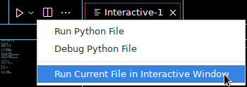

# Mathematical Constants

This is the first task. You must solve this task in the editor by defining
all variables that are specified in the table below.

- You can run your program at any time by selecting *Run File in Interactive
  Window*. In this view, called console in the further description,
  you see the output of your program and an input line.

<div align="center">

</div>

- With the "up arrow" you can return to previous commands in the console
  and execute them. You can enter names of variables in the console and
  then see the result.

- The keyboard shortcut `Shift-Enter` executes only the selected area in the editor.

- Be sure to read the introduction as well as the hints below! These
  help to do everything correctly.

## Introduction

In this task, the NumPy module is introduced and used to define initial variables.

### NumPy

Unlike Matlab, Python was not specifically developed for numerics, but
for general applications. Numerics is, in a sense, an additional function that must be imported from a
[module]. The simplest variant, which is also assumed in the [NumPy documentation], can be used with an abbreviation:

```python
import numpy as np
```

This allows, for example, the sine of 1 to be calculated as follows:

```python
np.sin(1.0)  # Output: 0.8414709848078965
```

### Exponential Function

The number $\mathrm{e}$ as such does not exist in Python. It must be constructed using the
function [exp]. If you want to calculate $\mathrm{e}^x$, you don't use `e**x` but `np.exp(x)`. Even if `e` is already defined as in this example,
you don't write `e**2` but `np.exp(2)` for $e^2$.

### Already Existing Variables

If you have already defined a variable for a certain quantity, then you should reuse it. Here in our example, `two_p` is already known, so when calculating $\sin 2\pi$ you don't write `np.sin(2 * np.pi)` but `np.sin(two_p)`.

### Screen Output

Run your script in the Python console and look at the value of the
variables you have already defined; for example, enter `e`.

As a result, you will see $2.718281828459045$. This is the complete representation
of the number $e$ in numerics. Of course, $e$ is a real number with infinitely many
digits after the decimal point, but in numerical calculation, you have to make do with a
limited number. This is defined by the specification of the size of the
storage space. For the standard data type [double], that's a total of $16$
digits. Non-significant zeros after the decimal point are not displayed in this representation.

### Precision

If you look at various results for the sine, you will find that
you see the expected results for $\sin 0$ and $\sin \pi/2$. For $\sin 2\pi$
you don't get zero but `-2.4492935982947064e-16`
as a result.
This means in mathematical notation
$-2.4492935982947064\cdot 10^{-16}$, which is a very small number but not
exactly zero. This small numerical error is the result of the limited
storage space for variables. Similar to the results for the sine, you will also
notice differences between `np.exp(2)` and `e**2`.

### Imaginary Unit

Another constant is the imaginary unit $j=\sqrt{-1}$, which is defined in Python.
When using it, however, you must always write `1j` and not `1*j` or
`j`, since the variable `j` may also have another value assigned to it. Your
results are only correct if you use the correct notation `1j`.

### Input of Numbers with Mantissa and Exponent

The representation of a so-called [floating point number] consists of a mantissa
($-2.4492935982947064$), a base ($10$), and the exponent ($-16$).

You can also define variables with this number format, e.g., `1.5e5`, `7.35e-15`

### Variable Names

For automatic testing, it is essential that you use
**<span style="color: red;">the specified names</span>** for your variables!
From the names used, you can see that the only allowed special character is the
underscore `_`. Variable names consist of
letters, numbers, and `_` and may not begin with numbers. Therefore, the
designations `2p` or `2_p` for $\sin 2\pi$ are not allowed.

## Task

Perform some simple variable definitions in the Python script `mathc` (File: `mathc.py`). Read the respective hints and try out the program
before you "submit" it.

1. Start by importing the `numpy` module.

1. Define the following variables.

$$
\begin{aligned}
\texttt{p}        & = \pi \\
\texttt{p\_half}   & = \pi/2 \\
\texttt{two\_p}    & = 2\pi \\
\\
\texttt{e}        & = \mathrm{e} \quad \text{(Euler's number)} \\
\texttt{e\_2}      & = \mathrm{e}^2 \\
\\
\texttt{s\_0}      & = \sin 0 \\
\texttt{s\_p\_half} & = \sin \pi/2 \\
\texttt{s\_p}      & = \sin \pi \\
\texttt{s\_two\_p}  & = \sin 2\pi \\
\\
\texttt{i\_1}      & = 2j \quad \text{(see introduction)} \\
\texttt{c\_1}      & = 3 + 4j \\
\texttt{c\_2}      & = 1 + j\pi \\
\\
\texttt{a}        & = 5 \\
\texttt{b}        & = 3 a \\
\texttt{a}        & = 7 \\
\\
\texttt{v\_1}      & = 1.5\cdot 10^{6} \quad \text{(mantissa and exponent, see introduction)} \\
\texttt{v\_2}      & = -3.7\cdot 10^{-10} \\
\end{aligned}
$$

3. For the variables `a` and `b`, consider what values they have at the end of the program
   and why this is so. Keyword: repeated assignments

## Hints:

- In the [Cheatsheet] you will find a comparison between the Python module NumPy and MATLAB.

- Python help for individual commands can be found at [exp] and [sin].

- Best practice: Use `np.exp(1)` instead of `np.e` as described in the task
  for Euler's number `e`. When using `np.e`, an error message is output in the test. This is because `np.exp(1)` and `np.e` have different
  data types. NumPy uses its own data types like `numpy.float64` to ensure
  consistency in numerical calculations. With `np.exp(1)`, the value is
  compatible with NumPy arrays, functions, and other libraries.

- Furthermore, `np.exp(2)` evaluates the function value of the exponential function at position 2,
  while `np.e**2` merely squares the value for `e`. Due to rounding errors,
  this results in slight differences in the result.

- The operators `+`, `-`, `*`, `/`, and `**` are called
  [arithmetic operators].

- A very practical form of help is available in the console. For example, you can call Python help for $\sin$ simply with `help(np.sin)`.

[arithmetic operators]: https://docs.python.org/3/library/stdtypes.html#numeric-types-int-float-complex "arithmetic operators"
[cheatsheet]: https://numpy.org/doc/stable/user/numpy-for-matlab-users.html "Cheatsheet"
[double]: https://numpy.org/doc/stable/user/basics.types.html "double"
[NumPy documentation]: https://numpy.org/doc/stable/index.html "NumPy documentation"
[exp]: https://numpy.org/doc/stable/reference/generated/numpy.exp.html "exp"
[floating point number]: https://en.wikipedia.org/wiki/Floating-point_arithmetic "Floating point number"
[module]: https://docs.python.org/3/tutorial/modules.html "Module"
[sin]: https://numpy.org/doc/stable/reference/generated/numpy.sin.html "sin"


## Keywords

- Variable names
- NumPy
- Imaginary unit