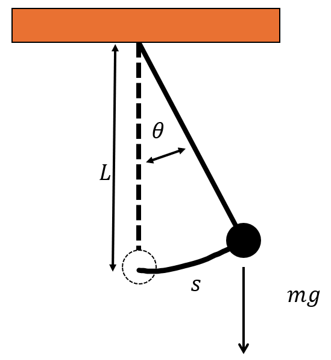

[solve_ivp]: https://docs.scipy.org/doc/scipy/reference/generated/scipy.integrate.solve_ivp.html

# Numerical Solution of Initial Value Problems

## Mathematical Introduction

For initial value problems, we discretize time using $t_n = t_0 + n \Delta t$ and introduce the notation $y_n = y(t_n)$. With this, we write

$$\begin{align*}
\dot{y}_n &= f(t_n, y_n) \\
y_{n + 1} &= y_n + \int_{t_n}^{t_{n+1}}dt' f(t', y(t')), \end{align*}
$$

which is still exact. We can now approximate the integral in various ways.


1. Explicit Euler method:
$$\int_{t_n}^{t_{n+1}}dt' f(t', y(t')) \approx  f(t_n, y_n) \Delta t$$

2. Midpoint method:
$$\int_{t_n}^{t_{n+1}}dt' f(t', y(t')) \approx f(t_{n+1/2}, y_{n+1/2}) \Delta t,$$
where we can approximate $y_{n + 1/2}$ as $y_n + f(t_n, y_n) \Delta t / 2$.


## Physical Introduction

A simple pendulum consists of a mass $m$ attached to a rigid, massless rod or string of length $L$ that can move freely under the influence of gravity. The motion of the pendulum can be described by the arc length $s$, the path the mass travels along its circular arc. As can be seen from the sketch, the force along $s$ is

$$
F_s = -m g \sin(\theta),
$$

where $g$ is the gravitational acceleration and $\theta$ is the angle between the vertical and the pendulum. Since this is a circular motion, $s$ is related to $\theta$ through the equation $s = L \theta$. The equation of motion therefore becomes

$$
m \ddot{s} = -m g \sin(\theta) \\
m L \ddot{\theta} = -m g \sin(\theta) \\
\ddot{\theta} = - \frac{g}{L} \sin(\theta).
$$


<div align="center">

</div>


However, our methods can only solve ordinary differential equations of first order. Therefore, we must convert the second-order ordinary differential equation into a system of first-order ordinary differential equations. To do this, we introduce the variables $\theta_1 = \theta$ and $\theta_2 = \dot{\theta}$. Thus we have

$$
\begin{bmatrix} \dot{\theta_1} \\ \dot{\theta_2}  \end{bmatrix} =
\begin{bmatrix} \theta_2 \\ -\frac{g}{L} \sin(\theta_1) \end{bmatrix} \; .
$$

This means that the function $f$ in the pendulum case does not explicitly depend on time and we can write the function as

```python
def pendulum_ode(t, y, g = 9.81, L = 3.0):
  """
  input:
  t: current time point
  y: Array [theta, omega], consisting of the current angle and angular velocity
  g: gravitational constant (default: 9.81 m/s^2)
  L: length of the pendulum (default: 1.0 m)

  output:
  Array [omega, - (g / L) * np.sin(theta)], representing the first derivative of theta and omega respectively
  """
  theta, omega = y
  return [omega, - (g / L) * np.sin(theta)]
```

where $ \omega = \dot{\theta}$ is the angular velocity.

## Task


  1. Write in `integrators.py` a function that uses the explicit Euler method according to the formula given above.
```python
  def euler_explicit(fun, dt, t_max, y_0):
      """
      input:
      fun: Function describing the differential equation system
      dt: step size
      t_max: end time
      y_0: initial values as array [theta_0, omega_0]

      output:
      t: Array of time points
      y: Array of solutions [theta, omega] at time points t
      """
```

2. Write in `integrators.py` analogously a function that uses the midpoint method according to the formula given above.


```python
  def midpoint(fun, dt, t_max, y_0):
      """
      input:
      fun: Function describing the differential equation system
      dt: step size
      t_max: end time
      y_0: initial values as array [theta_0, omega_0]

      output:
      t: Array of time points
      y: Array of solutions [theta, omega] at time points t
      """
```


3. Now use your functions in `pendulum.py` to solve the initial value problem. Create a subplot showing the angle and the angular velocity. Test different time steps `dt` $(\Delta t)$ and initial conditions `y_0`. Also add the solutions from the Runge-Kutta 45 method (RK45) from [solve_ivp], as well as those from the symplectic Euler method.


4. Write in `pendulum.py` the function `compute_energy(y, m=2.0, L=3.0, g=9.81,)`, which returns the total energy of the pendulum (kinetic and potential energy). The potential energy should be $0$ when the pendulum is at rest. Plot the energy as a function of time. Check whether the energy remains constant (increase `t_max` for this).

### Hints

* Reference plot:
<div align="center">

</div>
