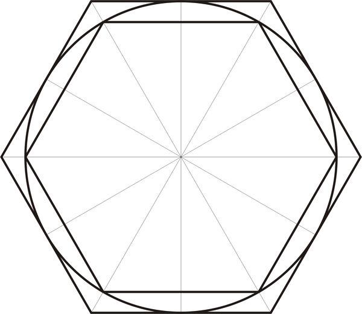
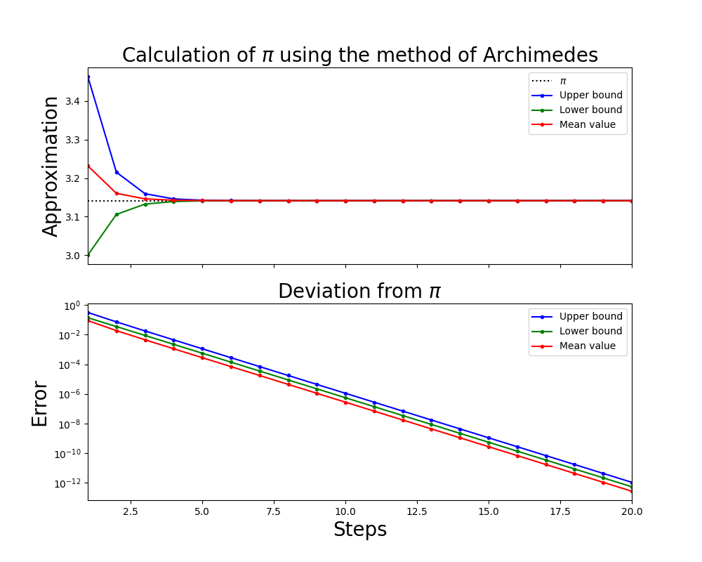

# Berechnung von $\pi$ nach der Methode von *Archimedes von Syrakus*

## Einleitung
Archimedes (287-212 v. Chr.), wohl einer der bedeutendsten Mathematiker und Physiker des Altertums, beschäftigte sich nicht nur mit den Hebelgesetzen oder dem Auftrieb, wofür er bekannt wurde, sondern auch mit der Annäherung von $\pi$. Es war zwar schon lange vor ihm bekannt, dass man den Einheitskreis durch Ein- und Umschreiben regelmäßiger Vielecke annähern kann. Seine Idee war es jedoch, $\pi$ durch einen Übergang von einem regelmäßigen $n$-Eck zu einem $2n$-Eck einzugrenzen. 

Durch geometrische Überlegungen fand er heraus, dass der Umfang $U_{2n}$ des äußeren $2n$-Ecks durch das harmonische Mittel von $U_n$ und $u_n$ (Umfang des äußeren bzw. inneren $n$-Ecks) gegeben ist, d.h.
$$U_{2n}=\frac{2 \cdot U_n \cdot u_n}{U_n + u_n}$$

Der Umfang $u_{2n}$ des eingeschriebenen $2n$-Ecks ergibt sich aus dem arithmetischen Mittel des Umfangs $U_{2n}$ des äußeren $2n$-Ecks und des Umfangs $u_n$ des inneren $n$-Ecks:
$$u_{2n}=\sqrt{U_{2n} \cdot u_n}$$

 

Archimedes begann für die Näherung von $\pi$ beim regelmäßigem 6-Eck, das in den Einheitskreis eingeschrieben ist. Das Besondere am regelmäßigen 6-Eck ist, dass 

* der Innenumfang $u_6=6$ und 
* der Außenumfang $U_6=4\sqrt{3}$ 

beträgt, wie man leicht nachprüfen kann.

Archimedes schaffte es mit dieser Methode bis zum regelmäßigen 96-Eck zu rechnen, indem er die Quadratwurzel durch geeignete Brüche approximierte und konnte so $\pi$ auf 
$$3\frac{10}{71} < \pi < 3\frac{1}{7}$$

eingrenzen.

## Aufgabe

Erledigen Sie folgende Aufgaben:

1. Definieren Sie die Variable `N=20` und initialisieren Sie Variablen `ua` und `ui` als Zeilenvektoren der Länge `N`, die später die Approximationen für $\pi$ enthalten sollen.

2. Implementieren Sie nun den Algorithmus von Archimedes, wobei Sie vom regelmäßigen 6-Eck ausgehen und insgesamt `N` Schritte ausführen. Speichern Sie dabei an `i`-ter Stelle der Variable `ua` die Näherung mithilfe des äußeren $n$-Ecks  im `i`-ten Schritt. Die Werte der inneren $n$-Ecke sollen in die Variable `ui` gespeichert werden. Beachten Sie, dass Sie den Umfang ($ U = 2 r \pi$, $r=1$) für die $\pi$-Näherung halbieren müssen, d.h. dass zum Beispiel `ui[0] = 3` ist.

3. Bilden Sie den arithmetischen Mittelwert der Werte der äußeren und inneren $n$-Ecke für jeden Schritt und speichern Sie diese in der Variable `m`.

4. Geben Sie den Wert des letzen äußeren und inneren $n$-Ecks, deren Mittelwert und den Zahlenwert von $\pi$ mit jeweils dreizehn Nachkommastellen wie folgt aus:    
        `Outer:`&nbsp;&nbsp;`"jeweiliger Wert der Approximation"`     
        `Inner:`&nbsp;&nbsp;&nbsp;&nbsp;`"jeweiliger Wert der Approximation"`     
        `Middle:`&nbsp;&nbsp;`"jeweiliger Wert der Approximation"`     
        `Pi:`&nbsp;&nbsp;&nbsp;&nbsp;&nbsp;&nbsp;&nbsp;&nbsp;&nbsp;`"jeweiliger Wert der Approximation"`     

5. Erstellen Sie zwei Plots untereinander (mit subplot). Stellen Sie im ersten dar wie `ui`, `ua` und `m` nach $\pi$ konvergieren. Der zweite Plot soll ein halblogarithmischer sein in dem jeweils die absolute Differenz dargestellt ist.

6. Fügen Sie passende Beschriftungen hinzu.

## Hinweise

* Referenzplot:

