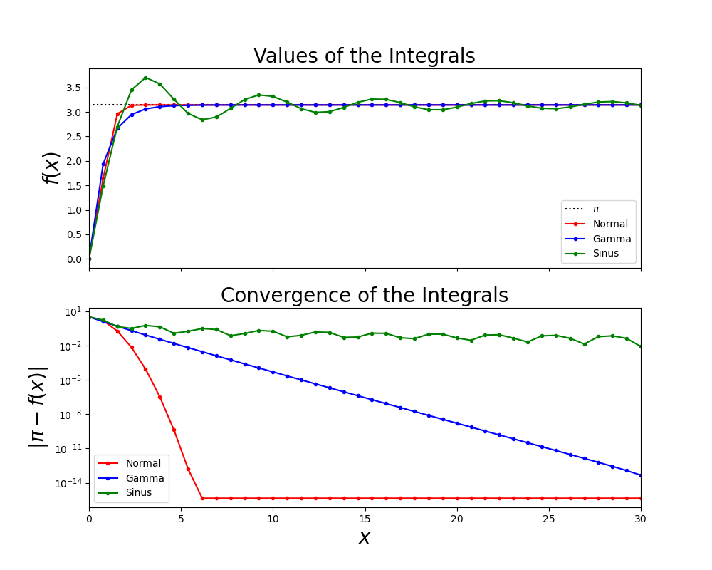

[lambda]: <https://python-reference.readthedocs.io/en/latest/docs/operators/lambda.html> "lambda"
[integrate.quad]: <https://docs.scipy.org/doc/scipy/reference/generated/scipy.integrate.quad.html#scipy.integrate.quad> "integrate"
[Beispiel]: <https://matplotlib.org/stable/gallery/text_labels_and_annotations/tex_demo.html> "Beispiel"
[semilogy]: <https://matplotlib.org/stable/api/_as_gen/matplotlib.pyplot.semilogy.html> "semilogy"

# Approximation von $\pi$ mit Integralen

## Einleitung

Es gibt einige interessante Integrale, in deren Lösung $\pi$ vorkommt. Über drei dieser Integrale wollen wir $\pi$ nun annähern.

*  In der Wahrscheinlichkeitsrechung ist das Integral über die [Normalverteilung](https://en.wikipedia.org/wiki/Normal_distribution) sehr wichtig:
$$
\int \limits_0^\infty e^{-x^2} dx = \frac{\sqrt{\pi}}{2}
$$

*  Auch sehr wichtig in der Physik ist der Funktionswert der [Gammafunktion](https://en.wikipedia.org/wiki/Gamma_function) an der Stelle $\frac{1}{2}$:
$$
\Gamma \left(\frac{1}{2}\right) = \int \limits_0^\infty e^{-x}
x^{-\frac{1}{2}}  dx = \sqrt{\pi}
$$

*  Eine sehr interessante Annährung an $\pi$ ergibt auch dieses Integral:
$$
\int \limits_0^\infty  \frac{\sin x}{x}  dx = \frac{\pi}{2}
$$

## Aufgabe

Erledigen Sie folgende Aufgaben:

1. Erzeugen Sie die Variablen `max_iter = 30` und `N = 40` sowie das Array `iteration_steps`, der in `N` Schritten von `0` bis `max_iter` gehen soll. Wie wir sehen werden, reicht der Endwert von `max_iter = 30` bei einigen Integralen schon sehr gut als obere Grenze aus, um annähernd gegen $\pi$ zu konvergieren.

2. Erzeugen Sie drei Nullvektoren `[pi_norm, pi_gamma, pi_sin]`, die die Länge von `iteration_steps` haben.

3. Speichern Sie die zu integrierenden Funktionen (siehe oben) als [lambda] Funktionen in `fun_norm`, `fun_gamma` bzw. `fun_sin`. Dabei ist mit `fun_norm` bspw. $e^{-x^2}$ gemeint.

4. Integrieren Sie die Funktionen mit [integrate.quad] folgendermaßen:
    * Um zu sehen, wie die Integrale gegen den Grenzwert $\pi$ konvergieren, soll in der Variablen `pi_i(n)` jeweils der Wert des Integrals, das von `0` bis `iteration_steps(n)` reicht, stehen.
    `i` steht dabei für `norm`, `gamma` oder `sin`.
    * Damit das Programm nicht immer über das gesamte Intervall integrieren muss, schreiben Sie eine `for`-Schleife, in der Sie die Integrale im Intervall `[iteration_steps(n-1),iteration_steps(n)]` berechnen. Um den Wert `pi_i(n)` zu erhalten, müssen Sie noch das Ergebnis der vorangegangenen Integrale `pi_i(n-1)` addieren.

5. Die Ergebnisse der Integration müssen noch potenziert bzw. mit entsprechenden Vorfaktoren multipliziert werden, damit sie $\pi$ ergeben!

6. Plotten Sie nun das Ergebnis mit Hilfe von zwei übereinander liegenden Subplots mit gemeinsamer $x$-Achse (`sharex = True`):
    * Der erste Plot soll zum einen eine Gerade beim Wert $\pi$ und zum anderen die Ergebnisse der Integrale enthalten. Plotten sie diese zuerst. Die Linieneigenschaften der Plots sind der untenstehenden Tabelle zu entnehmen. Nutzen Sie `axhline`.

    * Der zweite Plot soll halblogarithmisch in $y$ ([semilogy]) sein. In diesen Plot tragen Sie den Abstand ( $= abs(\pi_i - \pi)$ ) zu $\pi$ ein. Wieder sind die entsprechenden Formatierungen in der Tabelle zu finden. In diesem Plot sieht man gut, wie schnell die einzelnen Integrale gegen den Grenzwert konvergieren.

7. Setzen Sie für beide Diagramme `xlim` entsprechend der maximalen Integralgrenzen. Beschriften Sie zudem beiden Diagramme:
    * Die x-Achsen sollen jeweils mit "$x$" gekennzeichnet werden.
    * Die y-Achse soll beim ersten Plot mit "$f(x)$" und beim zweiten Plot mit "$|\pi - f(x)|$" beschriftet werden.
    * Der Titel des ersten Diagramms soll "`Values of the Integrals`" heißen.
    * Der Titel des zweiten Plots soll "`Convergence of the Integrals`" lauten.

8. Fügen Sie zu beiden Diagrammen jeweils noch eine Legende hinzu:
     * Die $\pi$-Gerade soll dabei mit "$\pi$",
     * die Funktion `fun_norm` mit "`Normal`",
     * die Funktion `fun_gamma` mit "`Gamma`" und
     * die Funktion `fun_sin` mit "`Sinus`" beschriftet werden.

    Die Legende im ersten Plot soll dabei in der rechten unteren und im zweiten Plot in der linken unteren Ecke platziert sein.

**Farbe und Muster für die Plots der verschiedenen Integrale:**

|Funktion | Farbe | Linienart
|---|---|---|
|$\pi$ | schwarz | punktiert
|`fun_norm` | rot | durchgehende Linie mit Punkten
|`fun_gamma` | blau | durchgehende Linie mit Punkten
|`fun_sin` | grün | durchgehende Linie mit Punkten

## Hinweise

* Referenzplot:

