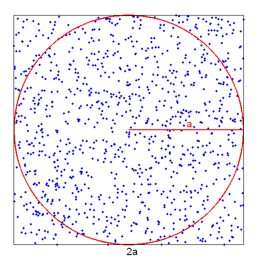

[np.random.rand]: <https://numpy.org/doc/stable/reference/random/generated/numpy.random.rand.html> "np.random.rand"
[cumsum]: <https://numpy.org/doc/stable/reference/generated/numpy.cumsum.html> "cumsum"

# $\pi$ - Just a Coincidence?

## Introduction
You can also calculate $\pi$ using random numbers! To do this, you randomly generate points inside a square with side length $2a$. Inside the square, there is also a circle with radius $a$, see sketch.

The area of the square is $A_\mathrm{Q} = 4a^2$ and that of the circle $A_\mathrm{K}  = \pi a^2$. The ratio of points $N_K$ that fall inside the circle to the points $N_Q$ that fall inside the square is therefore approximately the ratio of the areas:

$$
 \frac{N_\mathrm{K}}{N_\mathrm{Q}} \approx \frac{A_\mathrm{K}}{A_\mathrm{Q}} = \frac{\pi}{4}
$$

You can obtain an approximation for $\pi$ by dividing the points in the circle by the total number of points (since we do not allow points outside the square anyway). For a better approximation/error estimate, it is also recommended to repeat the "random experiment" often.

## Task
Complete the following tasks:

1. Create the variables `k = 50` and `N = 1E5`. `N` should be the total number of points to be generated, `k` the number of repetitions of the "experiment".

2. Now consider only a quarter of the circle/square. The ratio of points (inside)/outside remains the same. However, you can now use [np.random.rand] to create an `(Nx2)` array with random numbers between `0` and `1`. In this array, each row corresponds to a coordinate vector in the quarter square. Using the length of these vectors, you can determine whether the point is inside the quarter circle or not.

3. Initialize a row vector `p` of length `k`. In a loop, calculate `k` times an approximation for $\pi$ using (new) random numbers each time. Store all results in the vector `p`.

4. To better estimate $\pi$, also create the row vector `ps` of length `k`. At the `i`-th position, it should contain the mean of all previous results (mean of entries up to the `i`-th value of `p`).

5. To check the deviation of the approximation from the numerical value of $\pi$, create the variable `err_r`, which should contain the $\bf{relative}$ error of the last mean (i.e., relative deviation of `ps[-1]` from $\pi$).

6. Create a plot in which you draw
    * the value $\pi$ as a black solid horizontal line,
    * `p` as blue dots, and
    * `ps` as a red line with dots

    in this order

7. Output the exact value of $\pi$, the last value of the variable `ps`, and the relative error `err_r` one below the other with `print`. Here, $\pi$ and the last mean should be displayed with ten decimal places each, and `err_r` with three decimal places in exponential notation. For the test, it is important that it is a capital E, for example `1.234E-05`.

8. Create appropriate axis labels and choose an appropriate title.

## Hints
* For the mean, [cumsum] could be helpful.

* Do not forget that you have to consider a factor of $4$!
