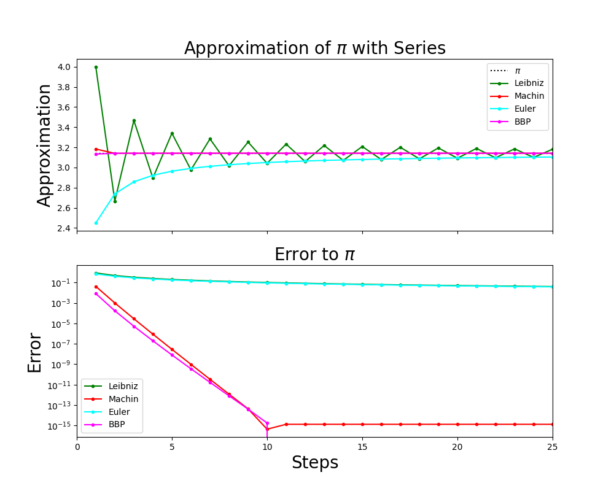

[np.cumsum]: <https://numpy.org/doc/stable/reference/generated/numpy.cumsum.html> "np.cumsum"
# Approximation von $\pi$ mit Reihen

## Einleitung

Eine der wohl wichtigsten und zum Teil schnellsten Methoden $\pi$ zu berechnen, ist jene mit Reihen. Aus diesem Grund sollen hier verschiedene Reihen vorgestellt werden, die in der Geschichte von $\pi$ eine große Rolle gespielt haben:

1. Gottfried W. Leibniz, einer der Begründer der Differenzialrechnung, leitete 1682 eine Reihendarstellung von $\frac{\pi}{4}$ her, die heute noch ihm zu Ehren Leibnizreihe genannt wird.
$$ \frac{\pi}{4} = \sum ^{\infty} _{k=0} \frac{(-1)^k}{2k+1} = 1 - \frac{1}{3} + \frac{1}{5} - \frac{1}{7} + \frac{1}{9} - \dots$$
Diese Reihe kann man auch über die Taylorentwicklung der $\arctan$-Funktion, die am Punkt $1$ ausgewertet wird, erhalten, da $\arctan (1) = \frac{\pi}{4}$ ist.

2. Da die Leibnizreihe leider sehr langsam gegen $\pi$ konvergiert, beschäftigte sich der Mathematiker John Machin weiter mit der Reihenentwicklung des $\arctan$ und fand eine sehr schnell konvergierende Reihe:
$$\frac{\pi}{4} = 4 \arctan \frac{1}{5} - \arctan \frac{1}{239} = 4 \cdot \sum ^{\infty} _{k=0} (-1)^k \frac{\left( \frac{1}{5}\right)^{2k+1} }{2k+1} - \sum ^{\infty} _{k=0} (-1)^k \frac{\left( \frac{1}{239}\right)^{2k+1} }{2k+1}$$
Mit dieser Reihe berechnete er 1706 $\pi$ auf 100 Stellen genau. Sie wird heute auch noch oft für die numerische Berechnung von $\pi$ verwendet.

3. Euler führte bereits in seinem ersten erschienenen Band <i>Introductio in Analysin Infinitorum</i> (1748) $\pi$ mit 148 Stellen an. Er entdeckte dabei mehrere Formeln für die Berechnung von $\pi$, die man aber fast alle auf die Reihenentwicklung von $\frac{\sin (x)}{x} = 1 - \frac{x^2}{3!}+\frac{x^4}{5!}-\frac{x^6}{7!}$ zurückführen kann. Ein Beispiel dafür ist:
$$\frac{\pi ^2}{6} = \sum ^{\infty} _{k=1} \frac{1}{k^2} = 1 + \frac{1}{4} + \frac{1}{9} + \frac{1}{16} + \dots$$
 
Die von Euler entdeckte Reihe entspricht auch gleichzeitig der Riemannschen $\zeta$-Funktion an der Stelle $2$, $\zeta (2) = \frac{\pi ^2}{6}$.

4. Eine sehr moderne Reihe ist die erst 1995 gefundene Bailey-Borwein-Plouffe-Formel (BBP-Formel). Diese ermöglicht nicht nur eine sehr schnelle Berechnung von $\pi$, sondern kann auch verwendet werden, um einzelne Stellen von $\pi$ zu berechnen, ohne die vorherigen zu kennen.
$$\pi = \sum ^{\infty} _{k=0} \frac{1}{16^k} \left( \frac{4}{8k+1} - \frac{2}{8k+4} - \frac{1}{8k+5} - \frac{1}{8k+6} \right)$$

## Aufgabe

Erledigen Sie folgende Aufgaben:

1. Erzeugen Sie die Variable `N = 25` und damit dann die Arrays `k0` (geht von `0` bis `N - 1`) und `k1` (geht von `1` bis `N`). `k0` soll dabei für jene Reihen verwendet werden, die bei Null beginnen und `k1` für jene, die mit $k = 1$ starten. Da Sie teilweise mit sehr kleine Zahlen arbeiten werden initialisieren Sie `k0` und `k1` als `np.float64`.

2. Speichern Sie in den Arrays `pv1`, `pv2`, `pv3` und `pv4` die Approximation für die oben angeführten Reihen. Dabei sollen in `pv1` die einzelnen Schritte der Reihe von Leibniz stehen, in `pv2` die von Machin, in `pv3` die von Euler und in `pv4` die Werte der BBP-Formel. Am einfachsten ist es, Arrays zu erzeugen, die die einzelnen Summanden enthalten und diese dann mit [np.cumsum] zu addieren. [np.cumsum] bildet dabei jeweils die Summe aus allen vorangegangenen Komponenten. Achten Sie darauf, dass nicht alle Summen mit $k=0$ beginnen! Benutzen Sie keine Schleifen!

3. Die Werte der Reihen müssen noch potenziert oder mit entsprechenden Vorfaktoren multipliziert werden, damit sie $\pi$ ergeben.

4. Plotten Sie nun das Ergebnis in zwei übereinander liegenden Subplots. Als $x$-Achse soll für beide Plots die Anzahl der verwendeten Schritte zur Reihenapproximation verwendet werden (also von `1` bis `N`). Der erste Plot soll zum einen eine Gerade beim Wert $\pi$ und zum anderen die Werte der Reihen beinhalten. Der zweite Plot soll halblogarithmisch in $y$ ([semilogy]) sein. In diesen tragen Sie den Abstand ( = `abs(pv-pi)` ) zu $\pi$ ein.    

5.  Erstellen Sie passend zur Aufgabe Achsenbeschriftungen, Titel und Labels.

## Hinweise

* Referenzplot:

