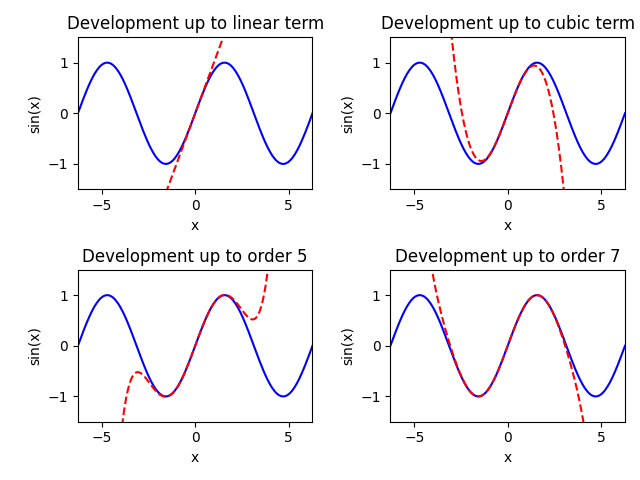

[Taylorreihe]: <https://de.wikipedia.org/wiki/Taylorreihe> "Taylorreihe"
[axes]: <https://matplotlib.org/stable/api/_as_gen/matplotlib.axes.Axes.html> "axes"
[figure]: <https://matplotlib.org/stable/api/_as_gen/matplotlib.pyplot.figure.html> "figure"
[linspace]: <https://numpy.org/doc/stable/reference/generated/numpy.linspace.html> "linspace"
[subplots]: <https://matplotlib.org/stable/api/_as_gen/matplotlib.pyplot.subplots.html> "subplots"
[xlim]: <https://matplotlib.org/stable/api/_as_gen/matplotlib.pyplot.xlim.html> "xlim"
# Taylorreihe des Sinus

## Einleitung

Die Taylorreihe für den Sinus bis zum vierten Glied lautet:
$$
  \sin(x) = x - \frac{x^{3}}{6} + \frac{x^{5}}{120} -
  \frac{x^{7}}{5040} + \dotsb
$$

Ziel dieser Übung ist, zu visualisieren, wie sich die [Taylorreihe]
mit jedem berechneten Glied dem exakten Ergebnis annähert.

## Aufgabe

1. Definieren Sie im skript `simple_taylor` folgende Variablen:

  |Variable|Wert|
  |-|-|
  |`x_max`|$2 \pi$|
  |`x`|Vektor mit 200 Stützstellen auf $[-x_{\text{max}}, x_{\text{max}}]$ ([linspace])|
  |`lim`|$1.5$|

2. Berechnen Sie damit die Variable `y`, welche als Werte den Sinus von `x` enthalten soll. 
Berechnen sie weiters `y1`, `y2`, `y3` und `y4`, welche die Werte für die (oben ersichtlichen) ersten vier Terme der Taylorreihe enthalten sollen (z.B. $\texttt{y1} = x$, $\texttt{y4} = -\dfrac{x^7}{5040}$).

3. Verwenden Sie den Befehl [subplots], um eine [figure] mit
mehreren Achsensystemen zu erzeugen.
  Stellen Sie $2 \times 2$ Achsensysteme in einer
[figure] dar. Jedes dieser Achsensysteme soll den Graphen der
Funktion $\sin(x)$ mit einer blauen, durchgezogenen Linie darstellen. 

4. Zusätzlich
dazu plotten Sie (jeweils mit einer roten strichlierten Linie) im Achsensystem:

*  die lineare Näherung
*  die kubische Näherung
*  die Taylorreihe bis zum dritten Glied
*  die Taylorreihe bis zum vierten Glied

Dabei soll in jedem Subplot zuerst die blaue Linie und dann die rote gezeichnet werden. 

5. Beschriften Sie jeweils die Achsen, und erzeugen Sie auch eine
Überschrift. Die x-Achse soll mit `x`, die y-Achse mit `sin(x)` gekennzeichnet werden. 
Die Überschriften entnehmen Sie der Referenz-Grafik in den Hinweisen.

6. Für eine schönere Darstellung empfiehlt es sich, die Grenzen der
x-Achse auf $[-x_{\max}, x_{\max}]$ und die der y-Achse auf `[-lim, lim]` zu
setzen ([xlim]).

## Hinweise

- [subplots] erwartet 2 Inputargumente. Dabei gibt das erste die Anzahl der „Zeilen“
und das zweite die Anzahl der „Spalten“ in der Figure an. Die zwei Rückgabewerte
werden konventionell mit `fig, axs` bezeichnet und beziehen sich jeweils auf die
[figure] und die beinhalteten Achsensysteme ([axes]). Letzteres ist ein zweidimensionales
Array, wobei wiederum der erste Index für die Zeile und der zweite Index für die Spalte steht.
`plot` wird dann auf diese Achsensysteme angewendet – man schreibt also
statt `plt.plot(...)` etwa `ax[1, 0].plot(...)`, um im Achsensystem in der zweiten Zeile
und ersten Spalte zu zeichnen.

- Damit sich die Subplots nicht in die „Quere“ kommen, empfiehlt es sich, vor `plt.show()`
noch den Befehl `fig.tight_layout()` anzuwenden, wobei `fig` wie zuvor erwähnt das erste
Output-Argument von `plot.subplots(...)` ist.

- Da die Variablen `y1` bis `y4` nur die einzelnen Terme
der Reihe enthalten, genügt es nicht, nur z.B. `y4` über `x`
zu plotten. Stattdessen müssen beim Plotten natürlich alle Terme niedriger
Ordnung dazuaddiert werden.

- Streng genommen ist die Bezeichnung der Terme mit den Indizes 1 bis 4
ungenau. Mathematisch gesehen ist bei einer Taylorreihe nämlich der erste Term
jener, in dem $x^{0}$ vorkommt, der zweite jener mit $x^{1}$, der dritte
(quadratische) mit $x^{2}$ usw. Hier werden nur die Terme durchnumeriert,
die nicht verschwinden.

- Ihre Graphik sollte so aussehen:

- Achten Sie darauf, dass die Achsenbeschriftungen und Überschriften der Referez-Graphik entsprechen. 
Achten Sie ebenfalls darauf, keine Leerzeichen vor oder nach den Labels und Titeln einzufügen (Verwenden Sie (`'x'`) nicht (`' x '`))

## Keywords

- Subplots