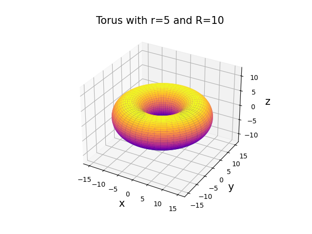

[meshgrid]: <https://numpy.org/doc/stable/reference/generated/numpy.meshgrid.html> "meshgrid"
[3D surface]: <https://matplotlib.org/stable/gallery/mplot3d/surface3d.html> "3D surface"

# Plot of a Circular Torus

## Introduction

### Mathematical Foundations
The surface of a [Torus](http://en.wikipedia.org/wiki/Torus) is defined by:
$$
\begin{aligned}
  x & =  [ R + r \cdot \cos(\theta) ] \cos(\phi) \\
  y & =  [ R + r \cdot \cos(\theta) ] \sin(\phi) \\
  z & =  r \cdot \sin(\theta)
\end{aligned}
$$

with the following torus coordinates:

* $\phi$: the toroidal angle $\phi \in [0, 2 \pi]$ and corresponds to `t` on Wikipedia.

* $\theta$: the poloidal angle with $\theta \in [0, 2 \pi]$ and corresponds to `p` on Wikipedia.

* $R$: the major radius, i.e., the distance from the center to the center of the tube.

* $r$: the minor radius, i.e., the radius of the tube.

## Task

Now write the script `torus` in which you display a torus.

1. For calculating the torus coordinates, write a function `torus_coor(phi, theta, r, R)` that takes the one-dimensional angles and scalar radii as input and outputs the two-dimensional ([meshgrid]) coordinates `x`, `y`, and `z`.

2. Then plot the surface of the torus in a 3D plot, where you can freely choose the support points as well as the details of the representation in the plot. However, the labeling should be meaningful.

3. Make sure that the axes are equally scaled.

4. Finally, save the image as a `.png` file.

## Hints
* [meshgrid]
* [3D surface]
* [Color maps](https://matplotlib.org/stable/users/explain/colors/colormaps.html)

