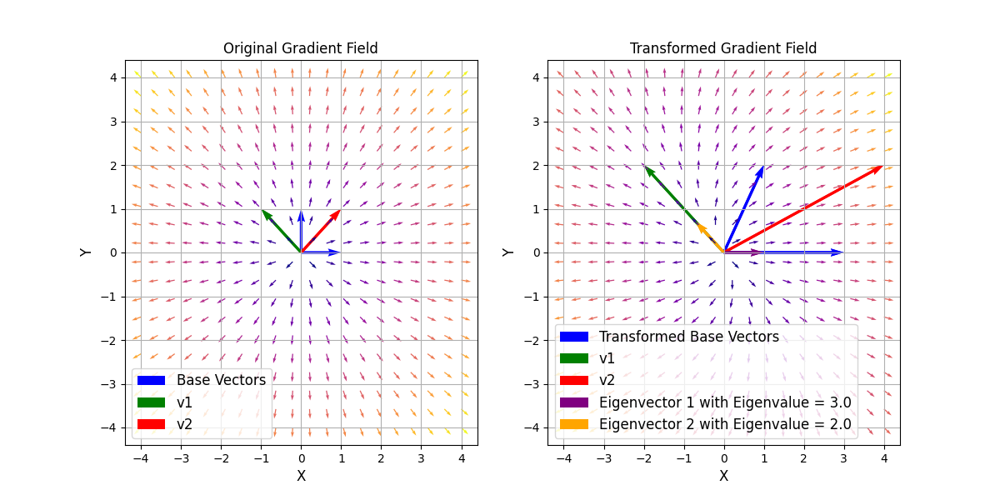

# Vector Fields and Eigenvectors

## Introduction
In this example, vector fields and eigenvectors are visualized to provide a basic understanding of their meaning and application. Eigenvectors and eigenvalues are central concepts in linear algebra that play an important role in various applications such as the analysis of linear transformations and the solution of differential equations.

Eigenvectors are special vectors that do not change their direction under their corresponding linear transformation, but are only scaled. The associated eigenvalues indicate by what factor the eigenvectors are scaled.
They are solutions of the equation:
$$
\hat{A}\vec{x} = \lambda \vec{x},
$$

where $\hat{A}$ is the transformation matrix, $\vec{x}$ is the eigenvector, and $\lambda$ is the eigenvalue.

This equation can be solved by:
$$
\det(\hat{A} - \lambda \hat{I})\vec{x} = 0
$$
where $\hat{I}$ is the identity matrix.

This example should make the concept of eigenvectors and eigenvalues intuitive. Additionally, you will gain insight into the visualization of vector fields.


## Task

1. Create a grid of $x$ and $y$ values using the command `np.meshgrid`. You can freely choose the start and end values for $x$ and $y$. The grid should have $N \times N$ points. Choose $N$ to be small at the beginning, e.g., $N=10$.

2. Calculate the gradient field for the scalar field $V(r) = r^2$ using the function `gradient_field`.


3. Plot the gradient field using [quiver](https://matplotlib.org/stable/api/_as_gen/matplotlib.pyplot.quiver.html) in a subplot. Here it is advisable to normalize the vectors so that they do not become too large. You can display the magnitude of the change in the scalar field with color.

4. Plot the basis vectors and the vectors `v1` and `v2`, where

  ```math
  \vec{v}_1 = \begin{bmatrix}
  -1 \\ 1
  \end{bmatrix}
  ```

  ```math
  \vec{v}_2 = \begin{bmatrix}
  1 \\ 1
  \end{bmatrix}.
  ```

5. Perform a linear transformation of the gradient field. The transformation matrix `transformation_matrix` should be equal to

  ```math
  \hat{A} = \begin{bmatrix}
  3 & 1 \\
  0 & 2
  \end{bmatrix}
  ```

6. Plot the transformed gradient field in a subplot next to the original gradient field. This should also be normalized and the color should represent the magnitude of the change in the scalar field.

7. Additionally plot the transformed basis vectors and `v1_trans` and `v2_trans`.

8. Display the eigenvectors of the transformation matrix $\hat{A}$ in the plot.

9. Choose a different transformation matrix and observe what happens.
  Why can the transformation

  ```math
  \hat{A} =\begin{bmatrix}
  1 & -1 \\
  1 & 1
  \end{bmatrix}
  ```

  not be displayed?

<dev align="center">
  
</dev>

## Hints

* For the linear transformation you can use the `@` operator or `np.matmul`.

* The commands `np.vstack` and `np.flatten` could be helpful.

* For normalization you can use either the function `np.linalg.norm` or the function `np.sqrt`.

* For this example there are limited tests. Therefore, check using the figure whether your solution is correct.
