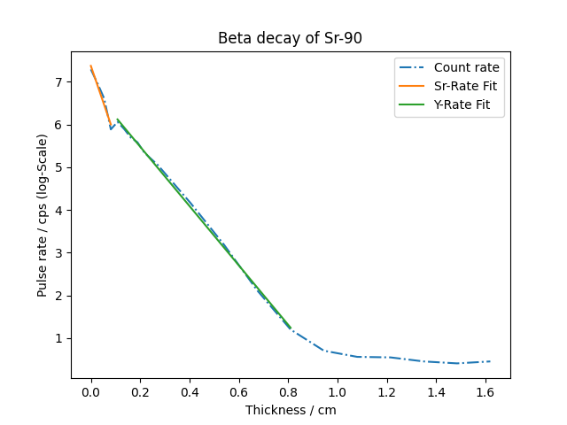

[Mass Absorption Coefficient]: <https://en.wikipedia.org/wiki/Mass_attenuation_coefficient>

# Beta Absorption

This example is intended to give you a summary of the topics from the first 3 weeks of this exercise.
If possible, you should be able to solve the task without hints or help from tutors. If after
several attempts you cannot make progress, we will be happy to help you.

## Introduction

In a laboratory experiment, the radioactive decay of a sample is measured using a Geiger-Muller counter.
This involves Strontium-90 (Sr-90), a $\beta$-emitter that decays into Y-90. Y-90 itself is still
an unstable nucleus that transforms into Zr-90 through another $\beta$-decay with a different half-life.

$$
    {}^{90}_{38}Sr \rightarrow {}^{90}_{39}Y \rightarrow {}^{90}_{40}Zr
$$

When radioactive radiation is to be shielded by a material, both the type of material (element) and the
thickness of the material play a role in the efficiency of the shielding. The *[Lambert-Beer Law]*
describes how the intensity of radiation changes when passing through a material as a function of the material's thickness.

$$
    I(d) = I_0 \cdot e^{-\mu \cdot d}
$$

Here, $I_0$ is the original intensity, $d$ is the layer thickness, and $\mu$ is the absorption coefficient of the material.
If the pulse rate is plotted logarithmically against the layer thickness, an absorption curve is obtained:

$$
    \ln I = -\frac{\mu}{\rho} \cdot (\rho \cdot d) + \ln I_0
$$

The slope of the logarithmic pulse rate $\mu / \rho$ is the so-called *[Mass Absorption Coefficient]*, an important parameter in radiation physics
($\rho$ is the density of the material).

## Task

In the following task, the mass absorption coefficients of Yttrium and Zirconium when passing through Aluminum are to be determined.

1. In the file `beta_absorption.csv`, the measurement duration and the number of pulses in the Geiger-Muller counter were stored for various layer thicknesses of an aluminum plate.
   * Column 1: Thickness (mm)
   * Column 2: Measurement duration (min)
   * Column 3: Number of pulses
   Read the file with `np.loadtxt` and save the respective layer thicknesses, measurement durations, and pulses as NumPy arrays with the variable names `thickness`, `t`, and `N`.

2. Calculate the count rates from `N` and `t` in counts per second (cps) and save them in the array `I`. Note that the time unit in the data file is **minutes**.
3. Take the logarithm of the count rates.
4. To fit the formula with the logarithmic count rate, you need to multiply the array `thickness` by the density of aluminum. Assume a density of $\rho$ = 2.70 g/cm³ (pay attention to the correct unit conversion!)
5. Plot the logarithmic count rates as a function of $\rho\cdot d$. Use a dash-dot line and give the data the label `Count rate`.
6. Label the x-axis with `Thickness / cm` and the y-axis with `Pulse rate / cps (log-Scale)`. Give the graph the title `Beta decay of Sr-90`.
7. In the plot, you will notice that the data curve has a kink at a certain point. This is the point at which the maximum range of the Sr-90 radiation is reached and only the higher-energy Y-90 radiation can still penetrate the material. Identify the position of the kink based on the data points.
8. To determine the mass absorption coefficients of Sr-90 and Y-90 in aluminum, you need to perform 2 linear fits to the left and right of the kink. Proceed as follows:
    * Using indexing, create two arrays, `Sr_rate` and `thickness_Sr` for the region to the left of the kink, and two arrays `Y_rate` and `thickness_Y` for the region to the right.
    * Perform a linear fit using `np.polyfit` to determine the slope of the function.
    * Plot the 2 fitted functions with the determined slopes and y-intercepts together with the data in one graph.
    * In the first part of the count rate, Sr-90 radiation and Y-90 radiation are superimposed. Therefore, for the absorption coefficient of Sr-90, you need to subtract the two slopes from each other. Do not change the slope in the plot.
    * Give the two fits the labels `Y-Rate Fit` and `Sr-Rate Fit`.
9. Finally, you should output an `f-string` that gives the determined coefficients together with their uncertainties. For the uncertainties, take the square roots of the first entries of the covariance matrix from `np.polyfit`. The output should look like this:

```python
Mass absorption coefficient Strontium-90: (9.97 +/- 2.49) cm^2/g
Mass absorption coefficient Yttrium-90: (6.94 +/- 0.08) cm^2/g
```

## Hints

* For `np.polyfit` to output the covariance matrix, you must set `cov=True` in the function call.

* Pay attention to the correct units for the layer thickness! At the end, $\mu / \rho$ should have the unit `cm²/g`.

* Why is the uncertainty for the Sr-90 value much larger than for Y-90? Do you have an explanation for this?

* At the end, your graph should look like this:

<div align="center">

</div>
